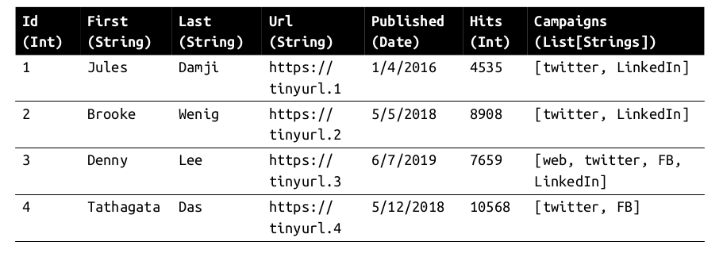
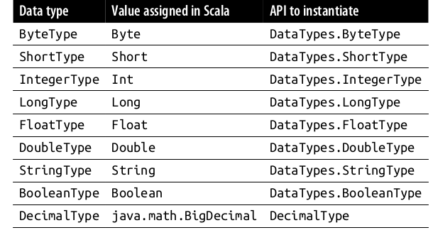
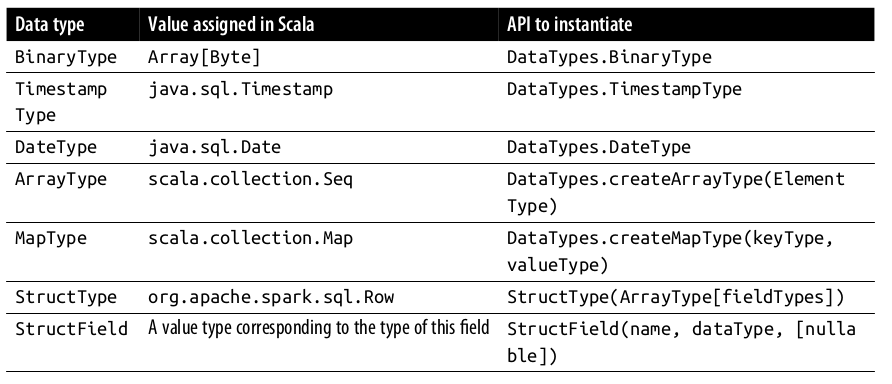
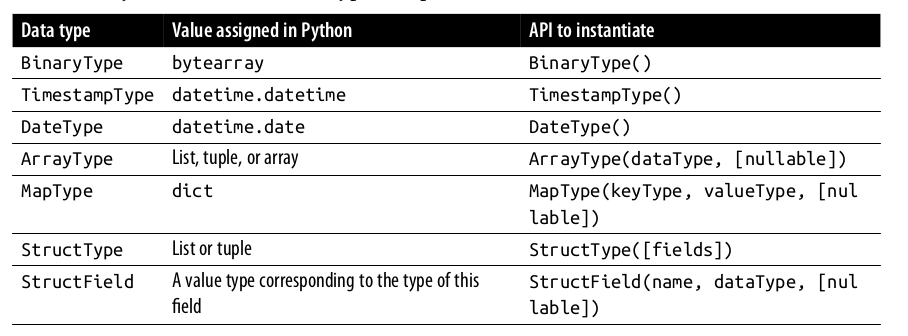

# Apache Spark's Structured APIs 

This chapter will discuss in detail about the structured API of Spark (DataFrames and DataSet). These APIs are built on the top of Spark native RDDs. This will also provide information regarding the Spark SQL engine that underpins these structured high-level APIs. 

## Spark RDD 
The RDD (Resilient Distributed Dataset) is the most basic abstraction in Spark. There are three vital characteristics of RDD.

- Dependencies 
- Partitions 
- Compute function : Partition => Iterator[T]

All three are integral to simple RDD programming API model upon which all higher-level functionality is constructed. 
First with the list of dependencies that instructs Spark how an RDD is constructed with its input required. Spark can recreate an RDD from these dependencies and replicate the operations on it. This provides the RDD resiliency 

Second, partitions provide RDD ability for split the work in parallel across different executors. This provides the locality feature where the data which is in the nearest storage get priority. 

Third, RDD has a compute function that produces an Iterator[T] foe a data that will be stored in RDD

There are some problems with this approach. The compute function is hidden from the Spark, it doesn't provide the information what type of transformation is required for the task. It only sees lambda expression. Whereas the Iterator[T] data type is also opaque for Python RDD, Spark only knows generic object in Python. Spark has no information about the accessing the column of a certain type of an object. Spark can only serialize the object as a series of bytes without any data compression technique.

## Spark Structuring 

Spark structuring allows various data structuring techniques on the data which allows various operations to be performed on structure like filtering, selecting, joining and aggregating. The final scheme of order and structure allow us to arrange the data into the tabular form like SQL. 

### Key Merits and Benefits 
Structuring allows number of benefits like better performance and space efficiency. It provides expressivity, simplicity, compose ability and uniformity.

## DataFrame API
Scala DataFrame API is inspired by Python Pandas DataFrame which has identical look and feel. 

DataFrame is immutable in Spark that means Spark remembers their lineage. We can add or change the data types of columns, creating new DataFrames while the previous versions are preserved. 

### Spark's Basic Data Types 
Spark has basic internal data types which includes for both Python and Scala. For Scala it has `String, Bytes, Long and Maps`

Similarly for python we have 


### Spark's Structured and Complex Data Types 
For Complex structures Spark also provides some complex APIs 



### Schemas and Creating DataFrames 
Schema is a column with name and datatype. Defining a Schema helps Spark to infer the data and read efficiently from a larges file. There are two ways to define a schema

### Two ways to define schema
We can define the schema using DDL (Data Definition Language) 
Example of defining in DataFrame API
```
// In Scala 
import org.apache.spark.sql.types._
val schema = StructType(Array(StructField("author", StringType, false),
            StructField("title", StringType, false),
            StructField("pages", IntegerType, false)))

// In python 
from pyspark.sql.types import *
schema = StructType([StructField("author", StringType(), False),
            StructField("title", StringType(), False),
            StructField("pages", IntegerType(), False)])

```

Example of defining using DDL 
```
// In Scala 
val schema = "author STRING, title STRING, pages INT"

# In Python
schema = "author STRING, title STRING, pages INT"

```
