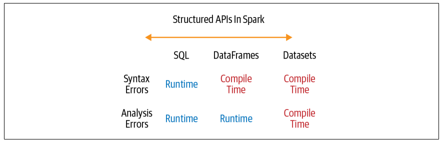
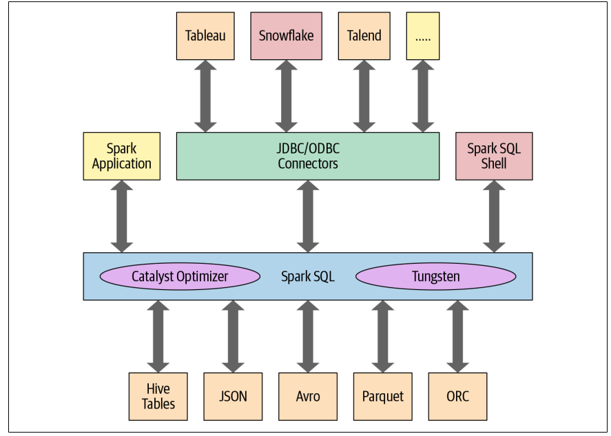
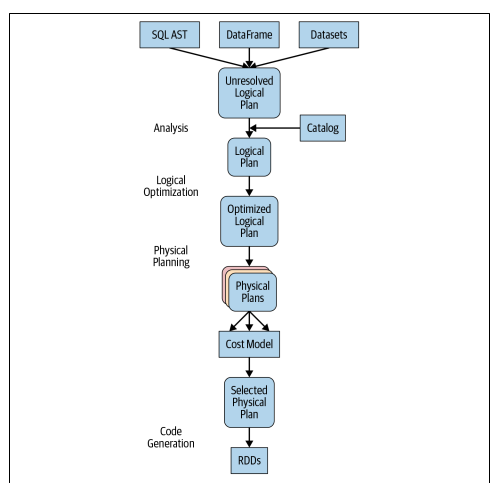
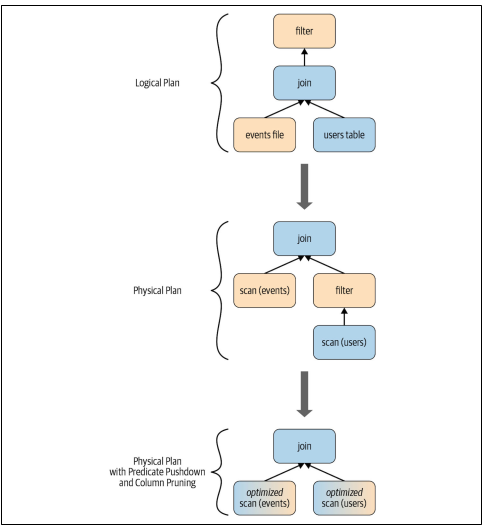

# Apache Spark's Structured APIs 

This chapter will discuss in detail about the structured API of Spark (DataFrames and DataSet). These APIs are built on the top of Spark native RDDs. This will also provide information regarding the Spark SQL engine that underpins these structured high-level APIs. 

## Spark RDD 
The RDD (Resilient Distributed Dataset) is the most basic abstraction in Spark. There are three vital characteristics of RDD.

- Dependencies 
- Partitions 
- Compute function : Partition => Iterator[T]

All three are integral to simple RDD programming API model upon which all higher-level functionality is constructed. 
First with the list of dependencies that instructs Spark how an RDD is constructed with its input required. Spark can recreate an RDD from these dependencies and replicate the operations on it. This provides the RDD resiliency 

Second, partitions provide RDD ability for split the work in parallel across different executors. This provides the locality feature where the data which is in the nearest storage get priority. 

Third, RDD has a compute function that produces an Iterator[T] foe a data that will be stored in RDD

There are some problems with this approach. The compute function is hidden from the Spark, it doesn't provide the information what type of transformation is required for the task. It only sees lambda expression. Whereas the Iterator[T] data type is also opaque for Python RDD, Spark only knows generic object in Python. Spark has no information about the accessing the column of a certain type of an object. Spark can only serialize the object as a series of bytes without any data compression technique.

## Spark Structuring 

Spark structuring allows various data structuring techniques on the data which allows various operations to be performed on structure like filtering, selecting, joining and aggregating. The final scheme of order and structure allow us to arrange the data into the tabular form like SQL. 

### Key Merits and Benefits 
Structuring allows number of benefits like better performance and space efficiency. It provides expressivity, simplicity, compose ability and uniformity.

## DataFrame API
Scala DataFrame API is inspired by Python Pandas DataFrame which has identical look and feel. 

DataFrame is immutable in Spark that means Spark remembers their lineage. We can add or change the data types of columns, creating new DataFrames while the previous versions are preserved. 

### Spark's Basic Data Types 
Spark has basic internal data types which includes for both Python and Scala. For Scala it has `String, Bytes, Long and Maps`

Similarly for python we have 


### Spark's Structured and Complex Data Types 
For Complex structures Spark also provides some complex APIs 


### Schemas and Creating DataFrames 
Schema is a column with name and datatype. Defining a Schema helps Spark to infer the data and read efficiently from a larges file. There are two ways to define a schema

### Two ways to define schema
We can define the schema using DDL (Data Definition Language) 
Example of defining in DataFrame API
```
// In Scala 
import org.apache.spark.sql.types._
val schema = StructType(Array(StructField("author", StringType, false),
            StructField("title", StringType, false),
            StructField("pages", IntegerType, false)))

// In python 
from pyspark.sql.types import *
schema = StructType([StructField("author", StringType(), False),
            StructField("title", StringType(), False),
            StructField("pages", IntegerType(), False)])

```

Example of defining using DDL 
```
// In Scala 
val schema = "author STRING, title STRING, pages INT"

# In Python
schema = "author STRING, title STRING, pages INT"

```
## Columns and expression 
DataFrame in Spark are inspired by the Pandas and R DataFrame they are like RDBMS table. We can list all the columns 
by their name and perform operation using relational or computation expressions. In spark columns are object with public methods (`Column` type) 

We can also apply logical or mathematical operations using `expr("columnName * 5")` where the `expr()` is a part of the `pyspark.sql.function` package. 

```
// In scala 
import org.apache.spark.sql.functions._
blogsDF.columns 

// Access a Particular column with col and it returns a Column type 
blogsDF.col("Id")

// Use an expression to compute a value 
blogsDF.select(expr("Hits * 2")).show(2)
// or 
blogsDF.select(col("Hits") * 2).show(2)
// Use an expression to compute bigger hitters for blogs 
// This adds a new columns, Bigger Hitters, based on conditional //expression 
blogsDF.withColumn("Big Hitters", (expr("Hits > 10000")))
// Concatenate three columns, create a new column, and show the
// newly created concatenated column
blogsDF
.withColumn("AuthorsId", (concat(expr("First"), expr("Last"), expr("Id"))))
.select(col("AuthorsId"))
.show(4)
// Sort by column "Id" in descending order
blogsDF.sort(col("Id").desc).show()
blogsDF.sort($"Id".desc).show()

```

`Column object` in a DataFrame can't exist in isolation; each column is a part of a row in a record and all the row together constitute a DataFrame, which as we wil see later in the chapter is really a Dataset[Row] in Scala

### Rows 
A row in Spark is a generic `Row Object`, containing one or more columns. Each colum many be od same data type or the have different data types. Row is an object in Spark and an Ordered collection of the fields, we can instantiate a Row in each of the Spark's supported language and access its fields by an index starting at 0 
```
// In scala 
import org.apache.spark.sql.Row 
// Create a Row 
val blogRow = Row(6, "Reynold", "url" , "3/2/2015", Array("twitter", "LinkedIn"))
// Access the Row 
blogRow(1)

# In python 
from pyspark.sql import Row 

blog_row = Row(6, "Reynold", "url", "3/2/2015", ["twitter" , "LinkedIn"])
blog_row[1]
```

Row Objects can be used to create the DataFrames in for quick and interactivity and exploration 

```
# In python 
rows = [Row("Metal x" , "CA"), Row("Reynold Xin" , "CA")]
authors_df = spark.createDataframe(rows, ["Authors" , "State"])
authors_df.show()


// In Scala 
val rows = Seq(("Matei Zahari", "CA") , ("Reynold Xin", "CA"))
authorDF = rows.toDF("Author" , "State")
authorDF.show()
```

### Common DataFrame Operations 
Spark provides read and write operation for the DataFrame. They are `DataFrameReader` and `DataFrameWriter`. 

### DataFrameReader and DataFrameWriter 
Reading and Writing are simple in Spark because of these high-level abstractions and contributions to connect various data sources like NoSQL stores, RDBMS, Streaming Engines like Apache Kafka 

### Transformation and Actions 

In this chapter we will see some of the transformations and actions operation on the DataFrame 

#### Projections and Filters 
`Projection` help us to get only machine rows based on some condition. 
We have `select()` and `filter()` projection for dataFrame()

```
# In Python
few_fire_df = (fire_df
.select("IncidentNumber", "AvailableDtTm", "CallType")
.where(col("CallType") != "Medical Incident"))
few_fire_df.show(5, truncate=False)
// In Scala
val fewFireDF = fireDF
.select("IncidentNumber", "AvailableDtTm", "CallType")
.where($"CallType" =!= "Medical Incident")
fewFireDF.show(5, false)
```
### Renaming, Adding and Dropping column 
We can rename the columns where the values are not in correct name format, for such operation we have `withColumnRename()` 
```
new_fire_df = fire_df.withColumnRenamed("Delay", "ResponseDelayedinMin")
new_fire_df
    .select("ResponsedDelayedinMin")
    .where(col("ResponseDelayedinMin") > 5)
    .show(5, False)

// In Scala
val newFireDF = fireDF.withColumnRenamed("Delay", "ResponseDelayedinMins")
newFireDF
.select("ResponseDelayedinMins")
.where($"ResponseDelayedinMins" > 5)
.show(5, false)
```
We can convert the `string` into `date/time` functions 
```
# In python 


// In Scala 
val fireTsDF = newFireDF
    .withColumn("IncidentDate", to_timestamp(col("CallDate"), "MM/dd/yyyy"))
    .drop("watchDate")
    .withColumn("OnWatchDate", to_timestamp(col("WatchDate"), "MM/dd/yyyy"))
    .withColumns("AvailableDtTS", to_timestamp(col("Available", "MM/dd/yyyy"))
    .drop("AvailableDtTm"))

// Select DataFrame with Converted columns 
fireTsDF
.select("IncidentDate", "OnWatchDate", "AvailableDtTs")
.show(5, false)
```
Similarly we can do for the `year(), month(), day()`

```
# In Python 
(fire_ts_df
    .select(year("IncidentDate"))
    .distinct()
    .orderBy(year("IncidentDate"))
    .show()
)

// In scala 
fileTsDF
    .select(year($"IncidentDate"))
    .distinct()
    .orderBy(year($"IncidentDate"))
    .show()
```

#### Aggregations 
 Aggregations can help to combine the data with column names band then aggregates count across them. 

```
# In Python
fire_ts_df
    .select("CallType")
    .where(col("CallType).isNotNull())
    .groupBy("CallType")
    .count()
    .orderBy("count", ascending=False)
    .show(10, truncate=False)

// In Scala
fireTsDF
    .select("CallType")
    .where(col("CallType").isNotNull)
    .groupBy("CallType")
    .count()
    .orderBy(desc("count"))
    .show(10, false)

```
For small number of DataPoint peek we should always use `take()` rather 
than `collect()` as it might explode the memory with large data size 

# Other aggregation 
We also have various other aggregation operations like `max(), min() min()`. We also have various statistical operation like `stat(),describe(), correlation(), covariance(), sampleBy(), approxQuantile(), frequentItems()`

## End to End DataFrame example 

• What were all the different types of fire calls in 2018?
• What months within the year 2018 saw the highest number of fire calls?
• Which neighborhood in San Francisco generated the most fire calls in 2018?
• Which neighborhoods had the worst response times to fire calls in 2018?
• Which week in the year in 2018 had the most fire calls?
• Is there a correlation between neighborhood, zip code, and number of fire calls?
• How can we use Parquet files or SQL tables to store this data and read it back?

## DataSet API 
DataSet is a Strongly typed collection of domain-specific objects that can be transformed in parallel using function or relational operations. Each DataSet [in scala] also has an untyped view called a DataFrame, which is a Dataset of Row 

### Typed Object, Untyped Object and Generic Rows 
In Spark DataSet make sense only in Java and Scala, whereas in Python and R DataFrame make sense. This is because in Python and R are not compile-time type safe; types are dynamically refereed or assigned during execution, not during compile time. The reverse is true in Scala and Java: types are bound to variable and object to compile time. In Scala DataFrame is just an alias for untyped Dataset[Row]
Row is a generic object type in Spark, holding a collection of mixed types that can be accessed using an index. 
```
// In Sala 
import org.apache.spark.sql.Row 
val row = Row(350, true, "Learning Spark 2E", null)

# In python 
from pyspark.sql import Row 
row = Row(350, True, "Learning Spark", None)

// Index 
row.getInt(0)
row.getBoolean(0)
row.getString(0)

# In python
row[0]
row[1]
row[2]
```
### Creating Dataset 
For Dataset it very important to know the schema and data types. We can specify the schema in Scala for specify the schema for resulting Dataset is to use a case class. 

### Scala : Case Class
When we wish to instantiate the domain-specific object as Dataset, we can do so by defining the case class in Scala. We can read the JSON file from the IoT device. 

```
Example JSON file 
{"device_id": 198164, "device_name": "sensor-pad-198164owomcJZ", "ip":
"80.55.20.25", "cca2": "PL", "cca3": "POL", "cn": "Poland", "latitude":
53.080000, "longitude": 18.620000, "scale": "Celsius", "temp": 21,
"humidity": 65, "battery_level": 8, "c02_level": 1408,"lcd": "red",
"timestamp" :1458081226051}

// To express each JSON entry as DeviceIoTData, a domain-specific object, we can define a Scala case class 

case class DeviceIoTData( battery_level : Long, c02_level : Long, 
cca2: String, cca3: String, cn : String, device_id : Long,
device_name : String, longitude : Double, scale : String, temp : Long,
timestamp : Long)

// Once we defined, we can read it to our file and convert the returned Dataset[Row]
into Dataset[DeviceIoTData]

val ds = spark.read
    .json("filePath")
    .as[DeviceToTData]
```
### Dataset operations 
Just like the DataFrame we can perform operation on Dataset 
```
// In Scala 
val filterTempDS = ds.filter({d => {d.temp > 30 && d.humidity > 70}})

```
We can use function as an argument in method filter(). This is an overloaded method with many signatures. The version is `filter(func: (T) > Boolean) : Dataset[T]`, takes a lambda function, func : (T) > Boolean, as its argument.

The argument to the lambda function is a JVM object of the `DeviceIoTData`. So we can access its individual data fields using the dot (.) notation, like would in a Scala class or JavaBean

In Dataset we can use language native expression like Scala or Java code ex `filter(), map(), groupBy(), select(), take()` - are similar to the DataFrame. Dataset are similar to RDDs in that they provide a similar interface to its aforementioned methods and compile-time safety but with a much easier to read and an object-oriented programming interface. 

## DataFrame vs DataSet 

1. If you want to tell Spark what to do, not how to do it, use DataFrames or Datasets. 
2. If you want rick semantics, high-level abstractions, and DSL operators, use DataFrame or Datasets 
3. If you want strict compile-time safety and don't mind creating multiple case classes for the specific Dataset[T], use Datasets. 
4. If your processing demands high-level expressions, filters, maps, aggregations, computing averages or sums, SQL queries, columnar access, or use of relational operators on semi-structured data then use DataFrames or Datasets. 
5. If your processing dictates relational transformations similar to SQL-like queries, use DataFrames. 
6. If you want to take advantages of and benefits from Tungsten;s efficient serialization with Encoders, use Datasets. 
7. If you want unification code optimization, and simplification of APIs across the Spark components, use DataFrames 
8. If you are a Python user, use DataFrames and drop down to RDDs if you need more control 
9. If you want space and speed efficiency, use DataFrames. 
10. If you want errors caught during compilation rather than runtime, choose appropriate API as depicted. 


### When to use RDDs
There are following scenarios where RDDs are required 
1. If using third-party package that's written in using RDDs. 
2. Can forgo the code optimization, efficient space utilization and performance benefits available with DataFrame and Datasets 
3. Want to precisely instruct Spark how to do query


## Spark SQL and the Underlying Engineer 

The Spark SQL engine allows us to do following operations 
- Unifies Spark components and permits abstraction to DataFrame/DataSets in Java, Scala, Python and R which simplifies working with structured data sets. 
- Connects to Apache Hive metastore tables.
- Reads asn writes structures data with a specific schema from the structured file formats (JSON, CSV, Text, Avro, Parquets, ORC etc) and convert data into temporary tables.
- Offers interactive SQL SQL shell for quick data exploration 
- Provides a bridge to external tools via standard database JDBC/ODBC connectors 
- Generates optimized query plans and compact code for the JVM for final execution 
  
  SQL engine are the Catalyst Optimizer and Project Tungsten. They support DataFrame and Dataset API and SQL queries 

### The Catalyst Optimizer 
The Catalyst Optimizer takes the computational query and converts into an execution plan. It goes through four transformational phases
1. Analysis 
2. Logical optimization 
3. Physical Planning 
4. Code Generation 
 

All language go through same execution cycle to execute the program. We can check the execution program cycle. `count_mnm_df.explain(True)` method for the DataFrame or to get a look at different logical and physical plans, in Scala you can call `df.queryExecution.logical` or `queryExecution.optimizedPlan`. 
```
// Table one
val userDF = ...
// Table two 
val eventDF = ...

// Join two DataFrames 

val joinDF = users
    .join(events, users("id") == events("uid"))
    .filter(events("date") > "2015-01-01")

```


### optimized phases 

#### Phase 1 : Analysis 
Te Spark SQL engine creates an abstract Syntax trr for the SQL DataFrame Query. In this phase, any column or table name will be resolved by consulting an internal `Catalog`, a programmatic interface to Spark SQL tha t holds a list of names of columns, data types, functions, tables, databases etc. Once they've all been resolved the query proceeds to the next phase. 

#### Phase 2 : Logical optimization 
The phase has two stages. Applying a standard rule based optimization approach, the Catalyst optimizer will first construct a set of multiple plans and then, using its cost-based optimizer (CBO) assign a cost to each plan. These plans are laid out as operator trees; they many include, for example, the process of constant folding, predicate push down, projection pruning, Boolean expression simplification etc. This logical plan is input into the physical plan. 

#### Phase 3 : Physical Planning 
In this Spark SQL generate the optimal physical plan for the selected logical plan, using physical operators that match those available in the Spark execution engine 

#### Phase 4 : Code generation 
The final stage generates efficient Java bytecodes to run on each machine. Because Spark SQL can operate on data sets loaded in memory, Spark can use state-of-the-art compiler technology for code generation to speed up the execution. It acts as a compiler, project Tungsten, which facilitates the whole-stage code generation, plays a role here. 

Whole-stage code generation is a physical optimization phase that collapse the whole query into a single function, getting rid of virtual function calls and employing CPU registers for intermediate data. The second-generation Tungsten engine uses this approach to generate compact RDD code for final execution. This streamlined stratergy significantly improves CPU efficiency and performance. 

