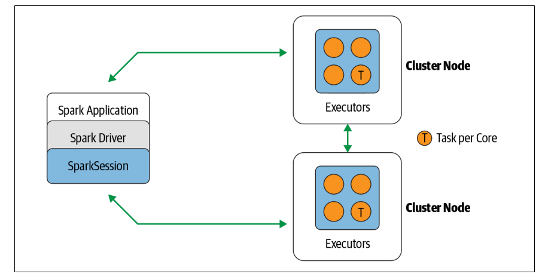
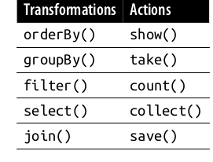

# Chapter 2 
## Download Spark and Getting Started 

### Downloading Spark 
We can download and install spark from the official spark repo. The spark repo run on JRE so java has to installed and JAVA_HOME has to be properly set. 

### Various component of Spark 
- ReadME.md 
  - This file includes all the instructions and the different information about the spark project 
- bin
  - This includes all the binaries which can be executed by typing in command lines 
- sbin
  - This mainly includes the administrative binaries 
- kubernetes 
  - Mostly kubernetes information 
- data 
  - The *.txt which can be served as input 
- examples 
  - Codes and working examples 
  
### Run spark on local machine 
Spark computation are expressed as operations. These operations are then converted into low-level RDD-based bytecode as tasks, which are distributed to Sparks executors for executions. 

### Understanding Spark Application Concepts 
Important terms related to spark 
- Application 
  - A program built using Spark API, it consists driver program and executors on the cluster 
- SparkSession 
  - An object the provides a point of entry to interact with underlying spark functionality and allows programming Spark and its APIs. In an interactive spark shell, spark driver instantiate a SparkSession for you while for an application you have to create a SparkSession object for you. 
- Job 
  - A parallel computation consisting of multiple tasks that get Spawn in response to a Spark action (eg. Save(), collect())
- Stage 
  - Each job is divided into several sets of tasks called stages that depends on each other 
- Task 
  - A single unit of work or the execution that will be sent to the Spark executor. 

## Spark Application and Spark Session 
At basic level Spark application is a spark driver program, which creates a SparkSession object. We can run spark locally on a single JVM or we can also launch a spark shell to analyze the data in parallel on a cluster in local model.

### Spark Jobs 
During interactive session with Spark shells, the driver converts you Spark application into one or more Spark Jobs. Then it transform each job into DAG. 

### Spark Stage 
Stages are created based on the operation that can be performed in serially or parallel. Not all the operation can happen in a single stage. 

### Spark Tasks 
Each stage is comprised of Spark tasks, which then federated across each Spark executor; each task maps to a single core and works on a single partition data. The stage puts all the tasks parallel, making spark tasks exceedingly parallel 

## Transformation, Actions and Lazy Evaluation 
Spark operations on distributed data can be classified into two types: 
*transformation* and *actions*. Transformation transforms the DataFrame without altering th original data, giving a property of immutability. Operations like *select()* and *filter()*.

All transformations are evaluated lazily. Their results are not computed immediately, but are recorded and remembered are a *lineage*. A records linage allows Spark, at a later time in its execution plan, to rearrange certain configurations. It also allows fault tolerance by providing immutability, it can reproduce its original state by replaying the record lineage, giving resiliency to the event of failure. 

An action triggers the lazy evaluation of the all the recorded transformation. 

## Narrow and Wide Transformation 
Transformation evaluated in Spark lazily and it for optimize the computation query to be processed efficiently. Transformation can be classified into as either *narrow dependencies* or *wide dependencies*A transformation where a single partition input is evaluated on single output is called a *narrow transformation*.

However, the *groupBy()* or *orderBy()* are the wide transformation, where data from other partitions is read, combine and written to disk. 

## Spark UI 
Spark UI provides the graphical UI for various spark operations, it runs on 4040 port when spark-shell starts. It has following metrics details 

- A list of Scheduler stages and tasks 
- A summary of RDD sizes and memory usage 
- Information about the environment 
- All of the Spark SQL queries 

## First Standalone application

We can write **Python** or **Scala** application using this github dir example `https://github.com/Rohan0401/LearningSparkV2`

-------------------------