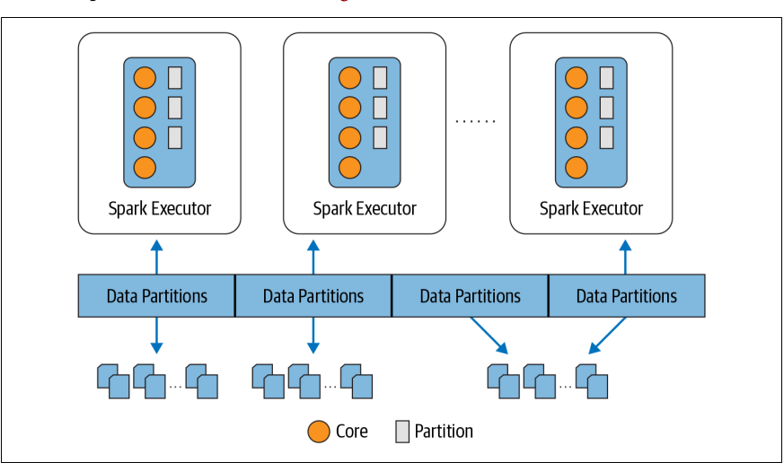

## Inception of Spark 
This chapter provides some details about the initial motivation for creation of Spark, it discussed about the Google Big Data and Distributed Computing technologies along with the various other improvement done on Apache Hadoop for the large scale data processing. It also discussed some of the complexity and limitations involved in working with above mentioned technology. Spark was created to overcome these issue and run massive computation with efficiency. 
## What is Apache Spark ?
Spark has unified engine which provides a unified engine for large-scale distributed data processing, on premisein data center or cloud. 
Speark proivdes following key charateristics 
1. Speed 
2. Ease of Use 
3. Modularity
4. Extensibility 

### Speed 
Spark utilizes the hardware and mordern high performace software techniques to improve the speed and memory consumption by using memeory, concurrency, multicore, threading and concurrency to speed up the task.
Spark builds query computation as Direct Acyclic Graph (DAG); its DAG scheduler and query optimizer construct an efficent computation graph that can useally decompose the tasa that are executed in parelllel across the cluster workers. 
Last is Tungusten code generator which generate a compact code which can execute the SQL query
### Ease of the Use 
Spark provides a fundamental abstraction of a simple logical datastructure called RDD (Resilent Distributed Datset) upn which all other higher-level structure data abstraction as DartaFrames, Datasets are constructed. It provided transformation and actions as operation
### Modularity 
Spark provides various programming lenguage APIs to support Scala, Java, SQL and Python etc. It also has Spark SQL, Structured Streaming, MLlib, and GraphX. 
### Extensibility 
Spark focuses on its fast, parellel computation engine rather than on storage. It can store dasta in Cassandra, HBase, MongoDB, Hive and many more. DataFrameReaders and DataFrameWriters can be extended to read data from other sources like Kafkam Kenisis, Storange, and S3 into its logical data abstraction on which it can operate. 
## Unified Analytics 
Spark provides a unified engine for all different types of analytics on a same distributed fast engine. 

## Spark SQL 
This module works well with the structured data with CSV, JSON, ORC, Parquet and then construct perment and temprory tables in Spark. 
Spark MLlib : Spark comes with a library contaning common machine learning algorithms which can help to parellelize the operation on spark 
## Spark Structure Streaming
It help to connect spark API to the various straming services like Apache Kafka
```# In Python
# Read a stream from a local host
from pyspark.sql.functions import explode, split
lines = (spark
.readStream
.format("socket")
.option("host", "localhost")
.option("port", 9999)
.load())
# Perform transformation
# Split the lines into words
words = lines.select(explode(split(lines.value, " ")).alias("word"))
# Generate running word count
word_counts = words.groupBy("word").count()
# Write out to the stream to Kafka
query = (word_counts
.writeStream
.format("kafka")
.option("topic", "output"))
```

## GraphX
It provides the Graph computation for the social media networks, graph topology and perform graph-parallel computation. It provides many algorithms to perform the graph traversal and connection analysis properties. 

```
// In Scala
val graph = Graph(vertices, edges)
messages = spark.textFile("hdfs://...")
val graph2 = graph.joinVertices(messages) {
(id, vertex, msg) => ...
}
```
## Apache Spark's Distribution Executions 
At a high level Spark consist a  driver program that responsible for orchestrating parallel operations on the Spark cluster. The driver access the distributed components in the cluster - the Spark executors and cluster mangers - through a SparkSession 


### Spark Driver 
Spark driver is responsible for instantiating the SparkSession, the Spark driver has multiple roles: It communicates with the cluster manager; it requests the recourses (CPU) from the cluster manager for the Spark executors (JVM) and it transforms all the Spark operations into DAG computation, schedules then and distributes their executions as tasks across the Spark executors. Onces resources are allocated, it communicates directly with the executors.  

### Spark Sessions 
It is a unified conduit to all the Spark operations and data. With this one conduit, we can create JVM runtime parameters, define DataFrames and Datasets, read from data sources, access catalog metadata and issue Spark SQL queries, SparkSession provides a single unified entry point for all the Spark functionality. 

Example: 
```
// In scala
import org.apache.spark.sql.SparkSession

// Build Spark Session 
val spark = SparkSession
.builder
.appName("LearnSpark")
.config("spark.sql.shuffle.partition", 6)

// Use the session to read the JSON
val people = spark.read.json("...")

// Use the session to issue a sql query
val resultDF = spark.sql("SELECT city, pop, state, zip FROM table_name")

```

### Cluster Manager 
The cluster manager allocates and manges the resources for the cluster nodes on which the Spark application runs. Spark supports stand-alone clusters, Apache Hadoop, YARN, Mesos and Kubernetes.

### Spark Executor 
A Spark executors runs on each worker node in the cluster. The executors communicates with the driver program and responsible for executing the tasks on the workers. During deployment mostly one executors runs per cluster.

### Deployments modes 
Spark Provides multiple deployment modes for various clusters, it can be deployed on Hadoop YARN or Kubernetes, there are following options available for the spark deployment 
 

### Distributed data and partitions 
The actual data is distributed across various storage as partitions and residing either in HDFS or cloud storage. Spark treats each data as high level logical data abstractions - as DataFrame in memory. Sometimes it is not possible, each Spark executor is preferably allocated a task that require it ot read the partition closest to it in the network, observing data locality. 

Partitioning allows for the efficient parallelism. A distributed scheme allows breaking up the data and partitions allows Spark executors to process only data that is close them, minimizing the network bandwidth. 


```
# Im python 
log_df = spark.read.text("path_to_large_text_file").repartition(8)
print(log_df.rdd.getNumPartitions())

# In python
df = spark.range(0, 100000, 1,8)
print(df.rdd.getNumPartitions())
```


