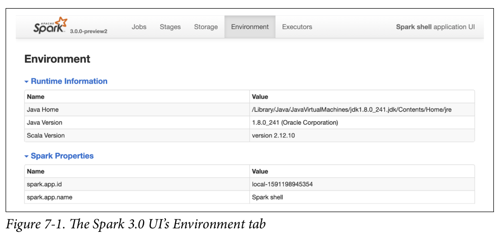
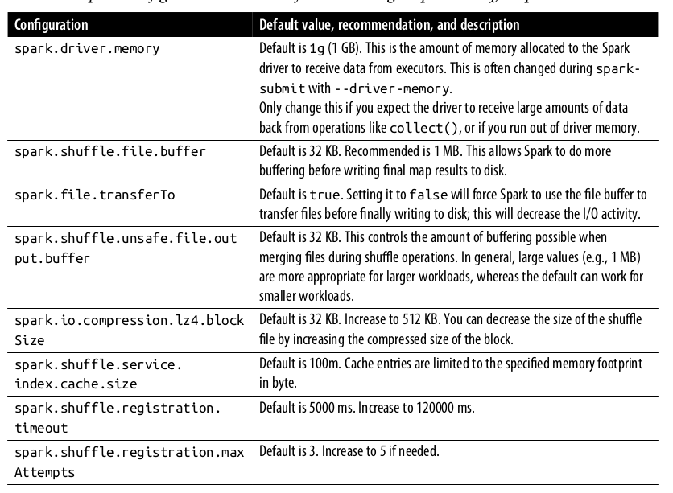
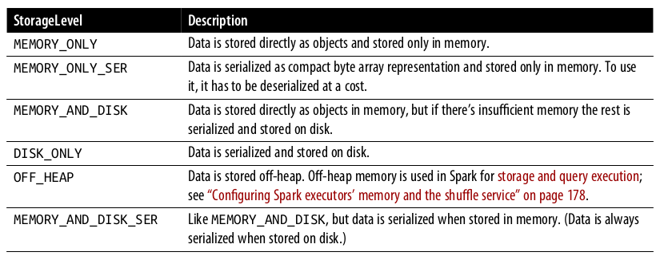
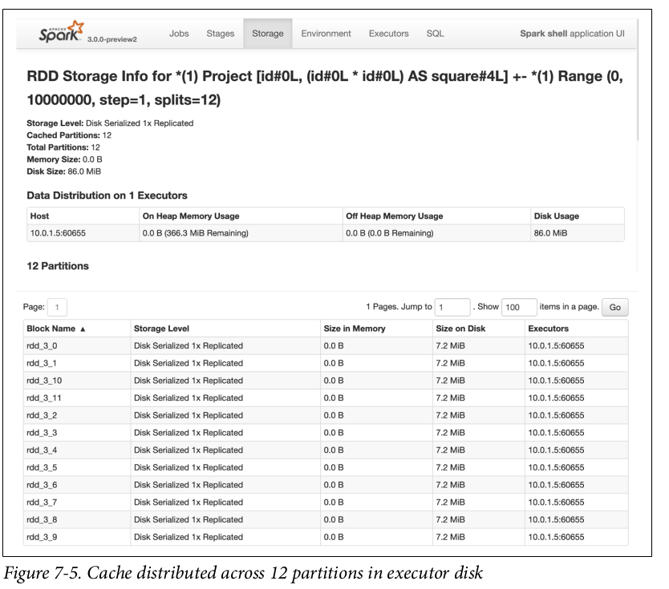
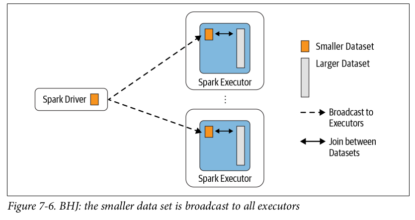
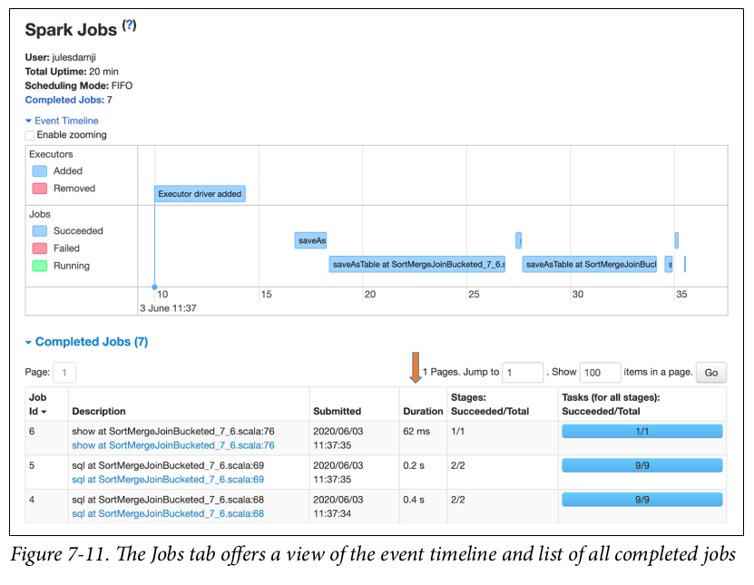
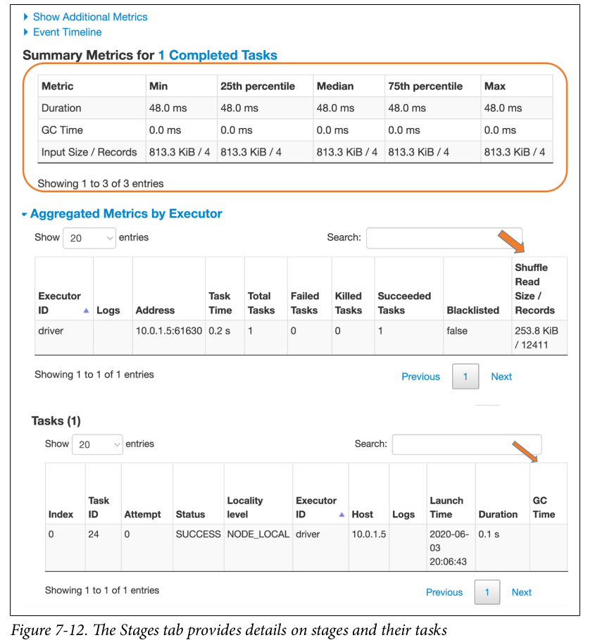
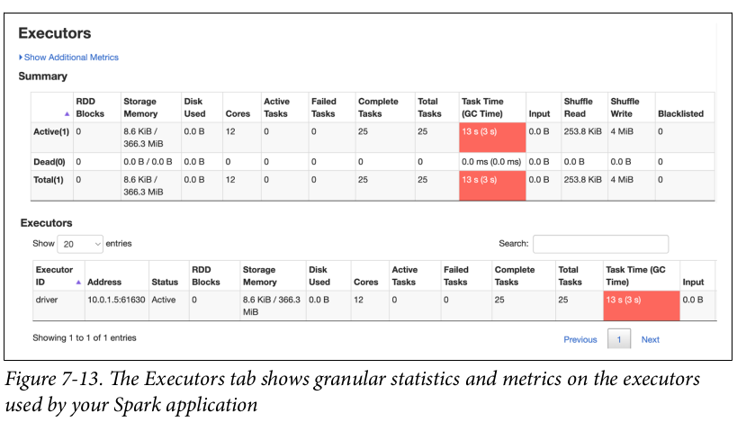
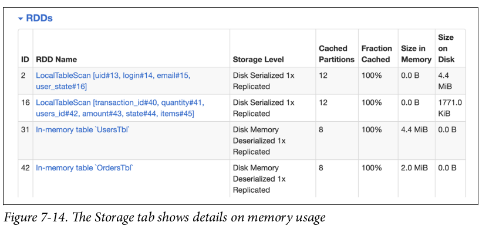
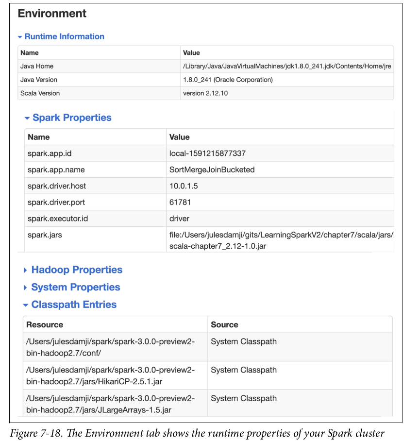

# Chapter 7 
## Optimizing and Tuning Spark Applications

In this chapter we will look into Spark configuration that enable optimization, look at Spark's family of join strategies and inspect the Spark UI, looking for clues to bad behavior. 

## Optimizing and Tunning Spark for Efficiency 

We will look into most important and commonly tuned configurations. 

### Viewing and Setting Apache Spark Configuration 
There are three ways to set configuration. 
First is to set configuration files in *$SPARK_HOME* directory config files: 
`conf/spark-defaults.conf.template, conf/log4j.properties.template, and conf/spark-env.sh.template`. We can change the default values and save it without the `.template` extension. 

Second way is to define the configuration to *spark-submit* using the `--conf` flag. 
```
spark-submit --conf spark.sql.shuffle.partition=5 --conf "spark.executor.memory=2g" --class main.scala.chapter7.SparkConfig_7_1 jars/main-scala-chapter_7_2.12-1.0.jar

// In Spark application 
import org.apache.spark.sql.SparkSession

def printConfigs(session: SparkSession) = {
    // Get conf 
    val mconf = session.conf.getAll
    // Print them 
    for (k <- mconf.keySet) {
        println(s"${k} -> ${mconf(k)\n}")
    }

def main(args: Array[String]) {
    // Create a session 
    val spark = SparkSession.builder
    .config("spark.sql.shuffle.partition", 5)
    .config("spark.executor.memory", "2g")
    .master("local[*]")
    .appName("SparkConfig")
    .getOrCreate()

    printConfigs(spark)
    spark.conf.set("spark.sql.shuffle.partitions",
    spark.sparkContext.defaultParallelism)
    println("********* Setting shuffle Partitions to Default Parallelism")
    printConfigs(spark)

}
}
```
Third option is through a programmatic interface via Spark-shell. We can use Spark REPL to provide all the configuration through the shell. 
```
// In Scala 
spark.conf.set("spark.sql.shuffle.partition", 5)

# In Python 
spark.conf.set("spark.sql.shuffle.partition", 5)

```
We can see all the configuration details via Spark UI. 

The configuration files get first preference of execution, followed by command line and then SparkSession

Tweaking or supplying the right configuration helps with performance. 

## Scaling Spark for Large Workloads 
To avoid job failure due to resource starvation or gradual performance degradation, there are many Spark configuration can be enabled and altered. These configuration affect three components : Spark driver, the executor and the shuffle service running on the executor. 

The Spark driver task is to coordinate with the cluster manager to launch the executor in a cluster and schedule Spark tasks on them. We present some techniques to optimize the tasks. 

### Static versus dynamic resource allocation 
Assigning resources in Spark submit limits the resource cap and that can't scale up when the resource required. However, in dynamic resource allocation configuration the compute capacity expands according to the workload requirement and it helps to accommodate the sudden peaks. 

One important use case for dynamic resource allocation is streaming.

To enable the dynamic resource allocation we can use following setting. 

```
spark.dynamicAllocation.enabled true 
spark.dynamicAllocation.minExecutors 2 
spark.dynamicAllocation.SchedulerBacklogTimeout 1m 
spark.dynamicAllocation.maxExecutors 20
spark.dynamicAllocation.executorIdleTimeout 2min

```
Spark driver will request the cluster manager create two executors to start with. As the task queue backlog increase new executor will be requested each time the backlog timeout is exceeded. Whenever there are pending task that have not been scheduled for over 1 minutes, the driver will request that a new executor be launched to schedule backlogged tasks, up to a maximum 20. If an executor finishes a task and is idle for 2 minutes the Spark driver will terminate it. 

### Configuration Spark executors' memory and shuffle service 
Addition to the resource allocation we should understand how the memory is laid out and used by Spark so that executors are not starved memory or troubled by JVM garage collection 

The amount of memory available to each executor is controlled by `spark.executor,memory`. This is divided into three sections: 
1. Execution memory (60%) 
2. Storage memory (40%)
3. Reserved memory (300MB)

These are the default memory allocation for the processes, however, we can alter the resource allocation by changing the baseline. When storage memory is not being used, Spark can acquire it for the execution memory and vice versa. 

Execution memory is used for Spark shuffles, joins, sorts, and aggregations. Since different queries requires different amount of memory, the fraction (`spark.memory.fraction` is 0.6 by default) of the available memory to dedicate to this can be tricky to tune but it's easy to adjust. By contrast, storage memory is primarily used for caching user data structures and partitions derived from DataFrames. 

During map and shuffle operations, Spark writes to and reads from the local disk's shuffle files, so there is heavy I/O activities. This can result in a bottleneck, because the default configuration are suboptimal for large-scale Spark jobs. Knowing what configuration to tweak can mitigate the risk during this phase of a Spark Job.

In the table there are a few recommendation provided for the configuration to adjust so that the map, spill, and merge processes during these operations are not encumbered by inefficient I/O and to enable these operations to employ buffer memory before writing the final shuffle partition to disk. Tuning shuffle service running on each executor can also aid in increasing overall performance for large Spark workloads. 

Spark configuration to tweak for I/O during map and shuffle operations 


### Maximizing Spark Parallelism 
Much of the Spark's efficiency in due to its ability to run multiple tasks in parallel in scale. We have to examine how Spark reads data into memory from storage and what partitions mean to Spark 

A partition is a way to arrange data into a subset of configurable and readable chunks or blocks of contiguous data on disk. These data can be read or processed independently and in parallel, if necessary, by more than a single thread in a process. The independence matters because it allows for massive parallelism of data processing. 

Spark is very efficient in processing data in parallel. For large-scale workloads a Spark job will have many stage, and within each stage there will be many tasks. Spark will at best schedule a thread per task per core,and each task will process a distinct partition. To optimize resource utilization and maximum parallelism, the ideal is at least as many partitions as there are cores on the executors. If there are more partitions than there are cores on each executors, all the cores are kept busy. We can think each partition as atomic unit of parallelism: a single thread running on a single core can work on a single partition. 

#### How partitions are created 
Spark's tasks process data as partitions read from disk into memory. Data on disk is laid out in chunks or contiguous file blocks, depending on store. By default, file blocks on data storage range in size from 64 MB to 128 MB. For example, on HDFS and S3 the default size is 128 MB. A contiguous collection of these blocks constitutes a partitions. 

The size of a partition in Spark is dictated by `spark.sql.files.maxPartitionBytes`. The default is 128 MB, decreasing the size will cause high I/O overhead and performance degradation. We can also use DataFrame API to design the partition 
```
// In Scala 
val ds = spark.read.textFiles("../README.md").repartition(16)
print(ds.rdd.getNumPartition)

val numDF = spark.range(1000L * 1000 * 1000).repartition(16)

```
Shuffle partition is 200 bt default which can be changed *spark.sql.shuffle.partition*.
Created during operations like *groupBy()* and *join()*, also known as wide transformation, shuffle partitions consume both network and disk I/O resources. During these operations, the shuffle will spill result to executors' local disks at the location specified to the `spark.local.directory`. Having performant SSD disks for this operation will improve the performance. 

Number of shuffle partition depends on case by case basis. 

To improve performance we can use caching and persist operations. 

## Caching and Persistance of Data 
`cache()` and `persist()` both offer control over how and where the data is stored - in memory and on disk, serialized and un-serialized. Both contributes to better performance for frequently accessed DataFrames or tables. 

### DataFrame.cache()
`cache()` will store as many of the partitions read in memory across Spark executors as memory allows. While DataFrame may be fractionally cached, partitions cannot be fractionally cached (If we have 8 partitions but only 4.5 fit into memory then only 4 will be cached). In this case the partitions that are not cached will have to recompute and it will slow down the Spark Job. 

```
// In Scala 
// Create a DataFrame with 10M records 
val df = spark.range(1,10000000).toDF("id").withColumn("square"m $"id"*$"id")
df.cache() // Cache data
df.count()// Materialize the cache 
// takes 5.11 seconds
df.count()
//takes 0.44 seconds 
```
### DataFrame.persist()
`persist()` is nuanced, provides control over how data is cached via summarizing the different storage levels. Data on disk always serialized using Java or Kyro serialization


```
// In Scala 
import org.apache.spark.storage.StorageLevel
// Create a DataFrame with 10M records 
val df = spark.range(1*10000000).toDF("id").withColumn("square", $"id" * $"id")
df.persist(StorageLevel.DISK_ONLY)
df.count() // Materialize the cache

df.count()// 0.38 Second

```


We can cache DataFrame, Tables and Views 

#### When to Cache and Persist 
- We should cache when we want to access a large data set for repeated queries or transformation.
- We have to do iterative machine learning training 
- We have to do frequent transformation during ETL or building data pipelines. 

#### When Not to Cache and Persist
- DataFrame is too big to fit in memory 
- Inexpensive transformation 

## A Family of Spark Joins 
The data movement with different joins and transformation is known as **Shuffle**. The main operations are `groupBy(), joni(), agg(), sortBy() and reduceByKey()`.

Spark has five distinct join strategies by which it exchanges, moves, sorts, groups and merges data across executors: 
1. Broadcast Hash Join (BHJ)
2. Shuffle hash Join(SHJ)
3. Shuffle sort Merge Join(SMJ)
4. Broadcast Nested Loop Join(BNLJ)
5. Shuffle-and-replicated Nested Loop(Cartesian product join)

BHJ and SMJ are the most common among all. 

### Broadcast Hash Join 
Also know as `map-side-only join`, the broadcast has join is employed when two data sets, one small (fitting in the driver's and executors memory) and another large enough to ideally be spared from movement, need to be joined over certain conditions or columns. Using a Spark broadcast variable, the smaller data set is broadcasted by the driver to all Spark executors and subsequently joined with the large data ser on each executors. This strategy avoids the large exchange. 


By default Spark will use a broadcast operation join only if the smaller data set is less than 10 MB. This configuration is set in the `spark.sql.autoBroadcastJoinThreshold`, we can change it. A common case when we have common set of keys between two DataFrames, one holding less information than other, and we need a merged view of both. 
```
// In Scala 
import org.apache.spark.sql.functions.broadcast 
val joinDF = playersDF.join(broadcast(clubsDF)), "key1 === key2")

```
BHJ is fasted join as it doesn't have to shuffle the data, if the data can fit into executor and driver memory this is the fastest join operation. 

we can see the plan by looking into 
`joinedDF.explain(mode)`

#### When to use a broadcast hash join 
- When ach key within the smaller and larger data sets is hashed to a same partition by Spark 
- When one data set is much smaller than other (within the default config of 10MB or specified value)
- When we want to perform an equi-join to combine two data sets based on matching unsorted keys 
- When we are not worried about excessive network bandwidth usage and OOM errors, because the smaller data set will be broadcast to all Spark executors. 
Setting `spark.sql.autoBroadcastJoinThreshold` will cause Spark to always resort to a shuffle sort merge join. 

### Shuffle Sort Merge Join 
The sort-merge algorithm is an efficient way to merge two large data sets over a common key that is sortable, unique, and can be assigned to or sorted in the same partition- that is, two data sets with a common hashable key that end up being on the same partition. For Spark perspective, this means that all rows within each data set with the same key are hashed on the same partition on the same executor. This means data has to be co-located or exchanged between executors. 
It has two phases sort and merge. The sort phase sorts data set by its desired join key; the merge phase iterates over each key in the row from each data set and merges the rows if the two keys match. 

Example 
```
// In Scala 
import scala.util.Random 
// Show preference over other join for large data sets 
// Disable broadcast join 
// Generate data 
...
spark.conf.set("spark.sql.autoBroadcastJoinThreshold", "-1")

// Generate some sample data for two data sets 
var states = scala.collection.mutable.Map[Int, String]()
var items = scala.collection.mutable.Map[Int, String]()
val rnd = new scala.util.Random(42)
// Initialize state and items purchased 
states += (0 -> "AZ" , 1-> "CA")
items += (0 -> "SKU-0", 1 -> "SKU-1" )

// Create DataFrames 
val userDF = (0 to 1000000).map(id => x"user_${id}", 
                s"user_${id}@databricks.com", states(rnd.nextInt(5)))
                .toDF("uid", "login", "email", "user_state")

val orderDF = (0 to 1000000)
            .map(r => (r, r, rnd.nextInt(1000), 10 * r * 0.2d,
            states(rnd.nextint(5), items(rnd.nextInt(5)))))
            .toDF("transaction_id", "quantity", "user_id", "amount", "state", "items")
// Do the join 
val userordersDF = orderDF.join(userDF, $"user_id" === $"uid")

// Show the joined result 
userOrderDF.show(false)
```
Optimizing Sort Merge Shuffle by removing exchange step. 
```
// In Scala
import org.apache.spark.sql.functions._
import org.apache.spark.sql.SaveMode
// Save as managed tables by bucketing them in Parquet format
usersDF.orderBy(asc("uid"))
.write.format("parquet")
.bucketBy(8, "uid")
.mode(SaveMode.OverWrite)
.saveAsTable("UsersTbl")
ordersDF.orderBy(asc("users_id"))
.write.format("parquet")
.bucketBy(8, "users_id")
.mode(SaveMode.OverWrite)
.saveAsTable("OrdersTbl")
// Cache the tables
spark.sql("CACHE TABLE UsersTbl")
spark.sql("CACHE TABLE OrdersTbl")
// Read them back in
val usersBucketDF = spark.table("UsersTbl")
val ordersBucketDF = spark.table("OrdersTbl")
// Do the join and show the results
val joinUsersOrdersBucketDF = ordersBucketDF
.join(usersBucketDF, $"users_id" === $"uid")
joinUsersOrdersBucketDF.show(false)

```


#### When to use a shuffle sort merge join 
- When each key within two large data sets can be sorted and hashed to the same partition by Spark 
- When you want to perform only equi-join to combine two data based on matching sorted keys 
- When toy want to prevent Exchange and Sort Operation to save large shuffles across the network 

## Inspecting Spark UI 
Spark UI provides information about memory usage, jobs, stages, and tasks, as well as event timelines in Spark applications both Spark driver level and individual executors. 

### Journey Through the Spark UI Tabs 
The spark UI has six tabs 


#### Jobs and Stages 
Spark breaks an application down into jobs, stages and tasks. The Jobs and Stages allow us to navigate through these and drill down to a granular level to examine the details of individual tasks. We can view their complet status and review metrics related to I/O, memory consumption, duration of execution. 


The Stages tab provides a summary of the current state of all stages of all jobs in the application. We can also access a details page of each stage, providing a DAG and metrics on its tasks. It has some optional statistics, like duration of each task, time spent in garbage collection (GC) and number of shuffle Read Blocked Time can signal I/O issues. A high GC time signals too many object on the heap.



#### Executors 
This provides information on the executors created for the application. We can drill down into the minutiae of details about resource usage (disk, memory, cores), time spent in GC, amount of data written during the shuffle. 


In addition to the summary statics, we can view how memory is used by each individual executor, and for what purpose. It also helps to examine the resource storage when we have used the `cache()` and `persist()`. 

#### Storage 
In the Spark model "Shuffle Sort Merge Join" we cached two managed tables after bucketing. The storage tabs provides information on any tables or DataFrames cached by the application as a result of the `cache()` or `persist()`. 


#### SQL 
The effects of Spark SQL queries that are executed as part of our Spark application are traceable and viewable through the SQL tab. We can see the queries were executed and by which jobs. It helps to see the data scan by the queries. 

#### Environment 
This can help us to troubleshoot about the environment variables, jars and Spark properties set. 
All these read-only details are good for looking the abnormal behavior from Spark 



