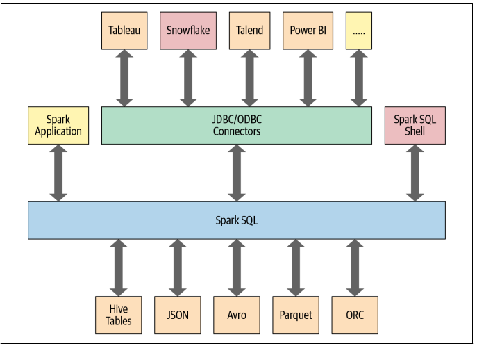
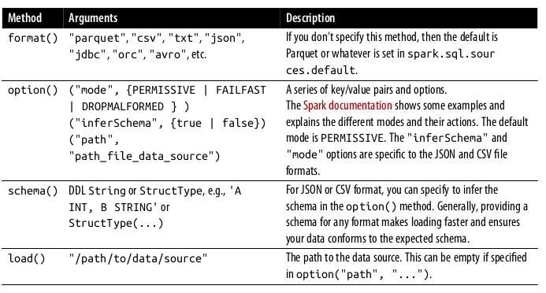
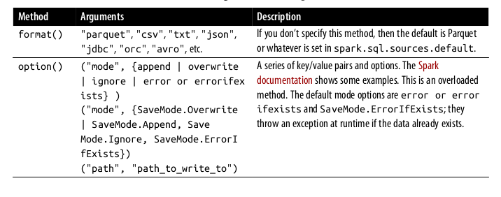
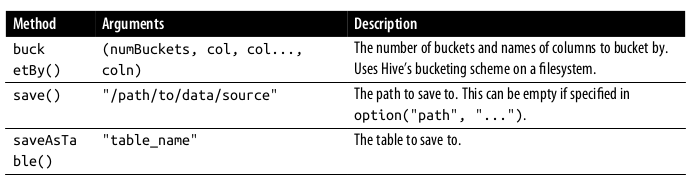
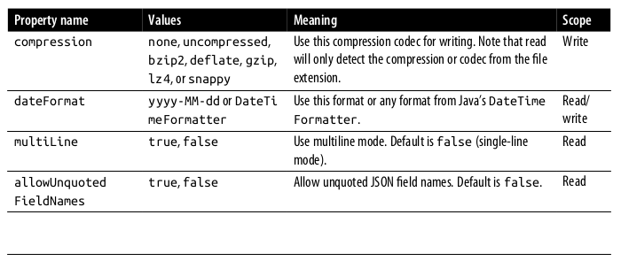
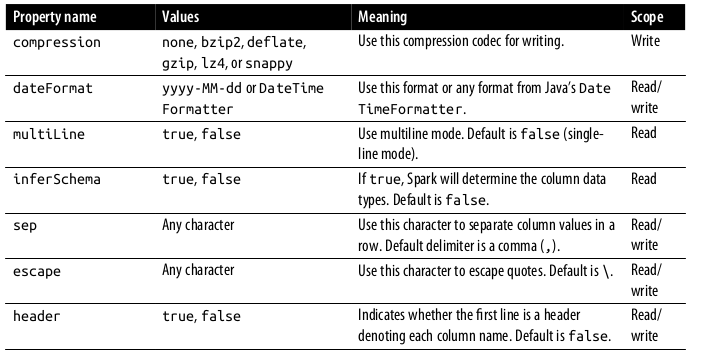
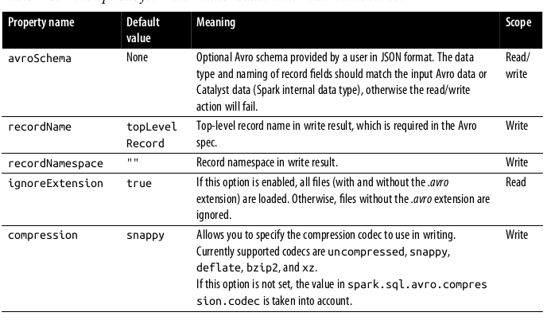

# Chapter 6 
# Spark SQL and DataFrames : Introduction to Built-in Data Sources 

----

In this chapter we will talk about DataFrames and its interoperability with Spark SQL. Spark SQL in provides 

- The engine upon the high-level Structured-API built 
- Can read and write data in a variety of structured formats (e.g. JSON, Hive, Parquet, Avro, ORC, CSV)
- Lets you query data using JDBC/ODBC connectors from the external business intelligence (BI) data sources like Tableau, Power BI and RDBMS databases like MySQL and PostgresSQL 
- Provides a programmatic interface to interact with structured data stored as tables or views in a database from the Spark application 
- Offers an interactive shell to issue SQL queries on your structured data 
- Supports SQL compliant commands and HiveQL 


## Using Spark SQL in Spark Application 
The `SparkSession` provides a unified entry point for programming Spark with the structured APIs. We can use `SparkSession` to access Spark functionality : just import the class and create an instance in your code. 

We can use the `sql()` method on the `SparkSession` instance, spark, such as `spark.sql("SELECT * FROM TableName")`, these operations return Spark DataFrames.

### Basic Query 
TO perform basic SQL operations we have to first create the `SparkSession`. This can be done by either using Python or Scala 
```
In Scala 
import org.apache.spark.sql.SparkSession 

val spark = SparkSession
    .builder
    .appName("SparkSQLExample")
    .getOrCreate()

// Path to dataset 
val csvFile = "/file_path"

// Read and create a temporary view 
// Infer schema 

val df = spark.read.format("csv")
    .option("inferSchema", "true")
    .option("header", "true")
    .load(csvFile)

df.createOrReplaceTempView("us_flight_delay_tbl")

# In Python 
from pyspark.sql import SparkSession 

spark = (SparkSession
    .builder
    .appName("SparkSQLExample)
    ,getOrCreate())

csv_file = "file_path"

df = (spark.read.format("csv")
    .option("inferSchema", "true)
    .option("header"m "true")
    .load(csv_file))

df.createOrReplaceTempView("us_flight_tbl")
```

Once we create the temporary view, we can apply many operations in the temp view using standard SQL queries, for example 

```
spark.sql("SELECT * FROM departure_table")
spark.sql("SELECT origin, destination FROM departure_table WHERE distance > 2000")

```
These query have the same API format like DataFrame in python 
```
%python 
from pyspark.sql.functions import col, desc 
(df.select("distance", "origin", "destination")
   .where(col("distance") > 1000)
   .orderBy(desc("distance"))).show(10)
```
We can write in the both ways

## SQL Tables and Views 
Spark uses Hive by default to store table metadata. We can change the the configuration variable using `spark.sql.warehouse.dir` to another location. The current location is `/user/hive/warehouse`

### Managed vs UnmanagedTables 
Spark allows two types of tables 
-  Managed 
-  Unmanaged 

For *managed* table, Spark manages both the metadata and the data in the file storage. This could be a local filesystem, HDFS, or an object storage such as Amazon S3 or Azure Blob. 

For unmanaged task Spark only manages the metadata while the data is managed by the external data source such as Cassandra 
The DROM_table_name will delete the data and metadata in managed table while in unmanaged it will only delete the metadata. 

### Creating tables using SQL 
We can create table using following command 
```
spark.sql("CREATE DATABASE learn_spark_db")
spark.sql("USE learn_spark_db")

```
From this point any command we issue in out application to create the table will result in the table is created in this database and residing under the database name learn_spark_db 
#### Create a managed table 

To create a managed table we will issue the command like 
```
// In scala/python
spark.sql("CREATE TABLE managed_us_delay_flights_tns (data STRING, delay INT, distance INT, origin STRING, destination STRING)")
```
For DataFrame API we can write 
```
# In python 
csv_file = "/filename"
# Schema as defined in the proceeding 
schema = "data STRING , delay INT, distance INT, origin STRING, destination STRING"
flights_df = spark.read.csv(csv_file, schema=schema)
flight_df.write.saveAsTable("managed_us_delay_flights_tbl")
```
Both will create a managed table in table us_delay_flights_table in learn_spark_db database

#### Creating unmanaged table 
By contrast, you can create unmanged tables from your own data sources - say Parquet, CSV or JSON file stored in a file accessible to your Spark application. 

We can use following command from a data source using a csv 

```
spark.sql("CREATE TABLE us_delay_flight(data STRING ... ) USING csv OPTION (PATH './file_path')")

# In Python 
(flights_df
.write
.option("path", "/tmp/data/us_flight_delay")
.saveAsTable("us_delay_flight_tbl"))
```

## Creating Views
We can create views in the Spark, they are different than Table because they don't hold the data and disappear after terminating the Spark session. 

```
-- In SQL
CREATE OR REPLACE GLOBAL TEMP VIEW us_origin_airport_SFO_global_temp_view AS SELECT * FROM us_delay_flights WHERE origin = 'SFO'

CREATE OR REPLACE GLOBAL TEMP VIEW us_origin_airport_JFK_global_temp_view AS SELECT * FROM us_delay_flights WHERE origin = 'JFK'

# DataFrame API 
df_sfo = spark.sql(SELECT * FROM us_delay_flight_table WHERE origin = 'SFO')
df_sfo.createOrReplaceGlobalTempView("us_origin_airport_SFO_global_tem_view")
```
Once we create these view we can query against them just like table 
```
SELECT * FROM global_temp.us_origin_airport_SFO_global_temp_view

```
We can also query and drop temp view 
```
SELECT * FROM us_origin_airport_JFO_temp_view

// In scala 
spark.read.table("us_origin_airport_JFK_temp_view")

# In python 
spark.sql("us_origin_airport_JFK_temp_view")

-- DROP 
DROP VIEW IF EXIST us_origin_airport_JFK_temp_view

// Scala/Python
spark.catalog.dropGlobalTempView("us_origin_airport_SFO_global_temp_view")
spark.catalog.dropTempView("us_origin_airport_JFK_temp_view")
```
#### TempView Vs Global Temp Views 
TempView is tied to a single `SparkSession` within the a Spark application. In contrast, a global temporary view is visible across multiple `SparkSession` within a single spark application. This can be helpful in case where we want to access data from different spark sessions that don't share the same Hive configuration. 

## Viewing the Metadata 
Spark manages the unmanaged associates with each managed or unmanaged table. This is captured in the `Catalog`, a high-level abstraction in the Spark SQL for storing the metadata. 
We can access the metadata using following commands 
```// Scala/python 
spark.catalog.listDatabases()
spark.catalog.listTables()
spark.catalog.listColumns("us_delay_flights_tbl")
```

## Caching SQL Tables 
We can also cache and uncache the SQL tables and views. We can also specify the table as LAZY meaning that is should only be cached when it is first used instead of immediately 
```
-- In SQL 
CACHE [LAZY] TABLE table_name 
UNCACHE TABLE table_name
```
### Reading data into DataFrame 
For building the data pipelines, we build regular data ingestion and ETL processes. We can populate the Spark SQL databases with the cleaned data for the consumption by application downstream. 

We can use SQL query to directly query the data and assign it to the table. 
```
// In scala 
val usFlightDF = spark.sql("SELECT * FROM us_delay_flight_tbl")
val usFlightDF2 = spark.sql("us_delay_flight_tbl")

```
Similarly we can read the data from multiple sources of Spark SQL built in table and data sources. 

## Data Sources from DataFrames and SQL Tables 
We can use various built-in API for Data ingestion and Data processing. 
For load and write we will use two high-level API `DataFrameReader` and `DataFrameWriter`

### DataFrameReader 
It is a core construct for the reading data from a data source into a DataFrame. It has a defined format and a recommended pattern of usage 
`DtaFrmaeReader.format(args).option("key", "value").schema(args).load()`
We can only get the DataFrameReader through SparkSession instance. We have to first initiate the SparkSession for that. We can get an instance handle to it 
```
SparkSession.read
// or 
SparkSession.readStream

```
Different arguments of the DataFrameReader 

Example for different ingestion 
```
// In Scala 
val file = "file_path"
val df = spark.read.format("parquet").load(file)
// use csv 
val df3 = spark.read.format("csv")
    .option("inferSchema" , "true")
    .option("header", "true")
    .option("mode", "PERMISSIVE")
    .load(file)_path)
// use JSON
val df4 = spark.read.format("json")
    .load(file_path)


```

### DataFrameWriter 
DataFrameWrite does the reverse of its counterparts: it saves or writes the data to respective built-in data source. Unlike DataFrameReader it can be access its instance not from a SparkSession but the DataFrame we wish to save

```
DataFrameWrite.format(args)
    .option(args)
    .bucketBy(args)
    .partitionBy(args)
    .save(path)

```
We can also use 
```
DataFrame.write
// or 
DataFrame.writeStream 

```



Example usage 
```
val location = ...
df.write.format("json").mode("overwrite").save(location)
```

### Parquet 
Parquet is an open source columnar file format that offers many I/O optimization (such as compression which saves storage space and allows for quick access to data columns)
This is one of the recommended format for the column based data format 

#### Reading Parquet files into DataFrame 
Parquet files are stored in directory structure that contains the data files, metadata, a number of compressed files and some status files. Metadata in the footer contains the version of the file format, the schema and column data 

Example 
```
_SUCCESS
_committed_1799640464332036264
_started_1799640464332036264
part-00000-tid-1799640464332036264-91273258-d7ef-4dc7-<...>-c000.snappy.parquet
```
Reading parquet 
```
// In Scala 
val file = "dir_path"
val df = spark.read.format("parquet").load(file)

# In python 
file = "file_path"
df = spark.read.format("parquet").load(file)

```
In SQL table 
```
-- In SQL 
CREATE OR REPLACE TEMPORARY VIEW us_delay_flight_tbl
USING parquet
OPTIONS (
    path "file_path"
)
```
Ince we create the table or view, we can read the data into a DataFrame using SQL as we saw
```
// In Scala 
spark.sql("SELECT * FROM us_delay_flights_tbl").show()

# In python 
spark.sql("SELECT * FROM us_delay_flights_tbl").show()
```

#### Writing DataFrame to a Parquet files 
Writing or saving a DataFrame as a table or a file is a common operation in Spark, To write in a DataFrame we simple use the methods and arguments to the methods and arguments to the DataFrameWrite 

```
// In Scala 
df.write.format("parquet")
    .mode("overwrite")
    .option("compression", "snappy")
    .save("/tmp/data/parquet/df_parquet")
# In python 
(df.write.format("parquet")
    .mode("overwrite")
    .option("compression", "snappy")
    .save("/tmp/data/parquet/df_parquet"))
```
For writing DataFrames to SQL table we just use saveAsTable than save method 
```
// In Scala 
df.write
    .mode("overwrite")
    .saveAsTable("us_delay_flights_tbl")
# In python
(
df.write
    .mode("overwrite")
    .saveAsTable("us_delay_flights_tbl"))
```
### JSON
JSON gha two representation format 
- Single line mode 
- Multiline mode
Both are supported in Spark, in Single-line mode each line denotes a single line denotes JSON object whereas in multiline mode the entire multiline object constitute a single JSON object. To read in this mode, set `setmultiLine` to true in the `option()` method. 

#### Read JSON
```
// In scala 
val file = 'file_path'
val df = spark.read.format("json").load(file)

# In python
file = "file_path"
df = spark.read.format("json").load(file)

-- In SQL 
CREATE OR REPLACE TEMPORARY VIEW us_delay_flights_tbl 
USING json 
OPTION (
    path 'file_path'
)
```
We can read the data from SQL once it is create 
```
// In scala/python
spark.sql("SELECT * FROM us_delay_flights_tbl").show()
```
#### Writing DataFrames to JSON files 
We can save the dataframe to json by using the appropriate DataFrameWriter method

```
// In Scala 
df.write.format("json")
    .mode("overwrite")
    .option("compression", "snappy")
    .save("/tmp/data/df_json")

# in Python
(df.write.format("json")
    .mode("overwrite")
    .option("compression", "snappy")
    .save("/tmp/data/df_json"))


```

### CSV 
We can use following methods for the CSV file to ingest the data 

#### Reading a CSV 
We can use the `DataFrameReader` method to ingest the data 
```
// In Scala
val file = "file_path"
val schema = "DEST_COUNTRY_NAMR STRING, ORIGIN_COUNTRY_NAME STRING, count INT"

val df = spark.read.format("csv")
            .schema(schema)
            .option("header", "true")
            .option("mode", "FAILTEST")
            .option("nullvalue")
            .load(file)
# In Python
file = "file_path"
 schema = "DEST_COUNTRY_NAMR STRING, ORIGIN_COUNTRY_NAME STRING, count INT"

df = (spark.read.format("csv")
            .schema(schema)
            .option("header", "true")
            .option("mode", "FAILTEST")
            .option("nullvalue")
            .load(file))

-- In SQL 
CREATE OR REPLACE TEMPORARY VIEW us_delay_flights_tbl
USING csv 
OPTION (
    path "file_path",
    header "true",
    inferSchema "true",
    mode "FAILTEST"
)
```
#### Writing to DataFrames to CSV Files 
Saving a file in CSV format 
```
// In Scala 
df.write.format("csv").mode("overwrite").save("/tmp/data/csv/df_csv")

# In python 
df.write.format("csv").mode("overwrite").save("/tmp/data/df_csv")

```

### Avro 
Avro format is used by Apache Kafka for message serializing and deserializing. If offers many benefits, including mapping to JSON, speed and efficiency, bindings available for many programming languages 

#### Reding file in Avro 
```
// In Scala 
val df = spark.read.format('avro')
    .load("file_path")

df.show(false)

# In python 
df = (spark.read.format('avro')
    .load("file_path"))

-- In SQL 
CREATE OR REPLACE TEMPORARY VIEW episode_tble
USING avro 
OPTIONS (
    path 'file_path'
)


```
#### Writing Avro files 

```
// In Scala
df.write
.format("avro")
.mode("overwrite")
.save("/tmp/data/avro/df_avro")

# In Python
(df.write
.format("avro")
.mode("overwrite")
.save("/tmp/data/avro/df_avro"))

```


### ORC 
ORC is a optimized columnar file format. Two spark configuration dictate which ORC implementation to use. Spark uses the vectorized ORC reader. It reads block of rows instead of the one row at a time, streamlining the operation like scans, filters, aggregations and joins. 

For Hive ORC SerDe (serialization and de-serialization) table create with the SQL command USING HIVE OPTION (fileFormat 'ORC'), the vectorized reader is used when the spark configuration parameter `spark.sql.hive.convertMetaStoreORC is set to be true. 

#### Reading ORD into a dataframe 

```
// In Scala
val file = "/databricks-datasets/learning-spark-v2/flights/summary-data/orc/*"
val df = spark.read.format("orc").load(file)
df.show(10, false)
# In Python
file = "/databricks-datasets/learning-spark-v2/flights/summary-data/orc/*"
df = spark.read.format("orc").option("path", file).load()
df.show(10, False)

-- In SQL
CREATE OR REPLACE TEMPORARY VIEW us_delay_flights_tbl
USING orc
OPTIONS (
path "/databricks-datasets/learning-spark-v2/flights/summary-data/orc/*"
)

```

#### Writing DataFrame to ORC files 

```
// In Scala
df.write.format("orc")
.mode("overwrite")
.option("compression", "snappy")
.save("/tmp/data/orc/df_orc")
# In Python
(df.write.format("orc")
.mode("overwrite")
.option("compression", "snappy")
.save("/tmp/data/orc/flights_orc"))

```

### Images 
Spark support image files for computer-vision based tasks. 

#### Reading an image file into DataFrame 
```
// In Scala 
import org.apache.spark.image 

val imageDir = "dir"
val imageDF - spark.read.format("image").load(imageDir)

imageDF.printSchema 

imagesDF.select("image.height", "image.width", "image.nChannel", "image.mode", "label").show(5, false)

# In Python 
from pyspark.ml import image 

image_dir = "dir_path"
image_df = spark.read.format("inmage").load(image_dir)
image_df.printSchema()

root
|--
|
|
|
|
|
|
|--
image: struct (nullable = true)
|-- origin: string (nullable = true)
|-- height: integer (nullable = true)
|-- width: integer (nullable = true)
|-- nChannels: integer (nullable = true)
|-- mode: integer (nullable = true)
|-- data: binary (nullable = true)
label: integer (nullable = true)
images_df.select("image.height", "image.width", "image.nChannels", "image.mode",
"label").show(5, truncate=False)
+------+-----+---------+----+-----+
|height|width|nChannels|mode|label|
+------+-----+---------+----+-----+
|288
|384 |3
|16 |0
|
|288
|384 |3
|16 |1
|
|288
|384 |3
|16 |0
|
|288
|384 |3
|16 |0
|
|288
|384 |3
|16 |0
|
+------+-----+---------+----+-----+
only showing top 5 rows

```
### Binary files 
Spark support binary files are a data source 

### Reading a file 

We can load files with the path matching a given global pattern while preserving the behavior of partition discovery with the data source option `PathGlobalFilter`
```

// In Scala
val path = "/databricks-datasets/learning-spark-v2/cctvVideos/train_images/"
val binaryFilesDF = spark.read.format("binaryFile")
.option("pathGlobFilter", "*.jpg")
.load(path)
binaryFilesDF.show(5)
# In Python
path = "/databricks-datasets/learning-spark-v2/cctvVideos/train_images/"
binary_files_df = (spark.read.format("binaryFile")
.option("pathGlobFilter", "*.jpg")
.load(path))
binary_files_df.show(5)

```
We can ignore the partitioning the data discovery in a directory, we can set the recursiveFile lookup to true 

```
// In Scala
val binaryFilesDF = spark.read.format("binaryFile")
.option("pathGlobFilter", "*.jpg")
.option("recursiveFileLookup", "true")
.load(path)
binaryFilesDF.show(5)
# In Python
binary_files_df = (spark.read.format("binaryFile")
.option("pathGlobFilter", "*.jpg")
.option("recursiveFileLookup", "true")
.load(path))
binary_files_df.show(5)
```
