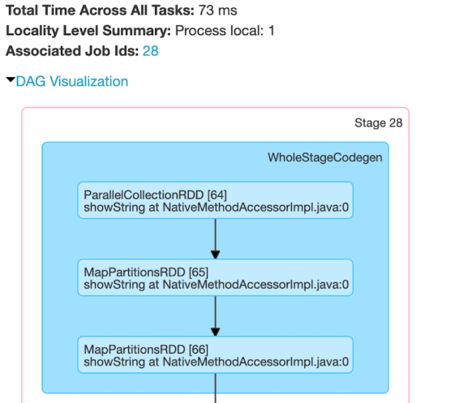
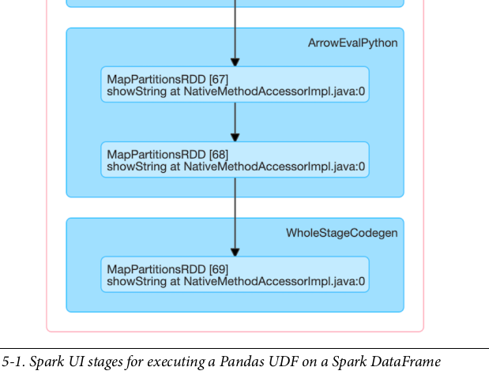
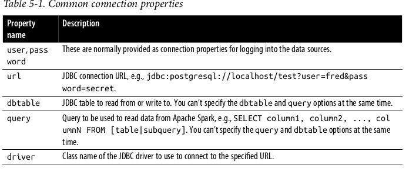
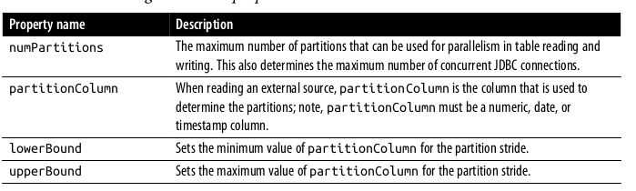
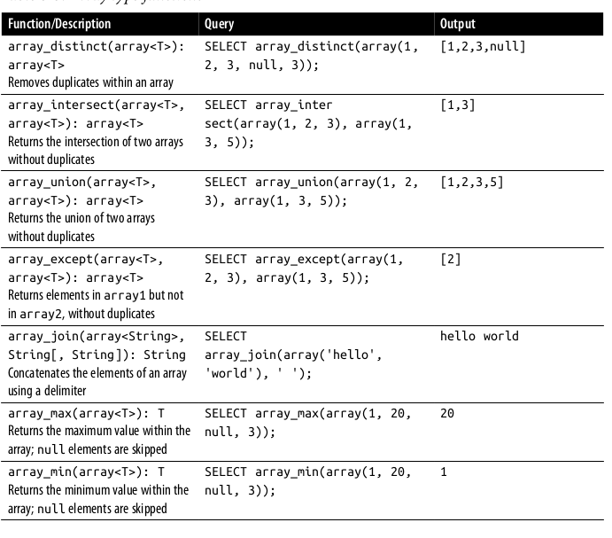
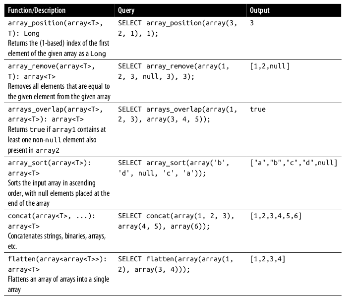
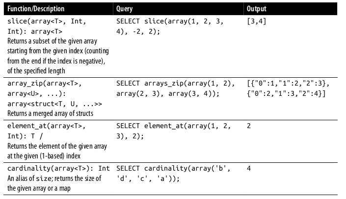
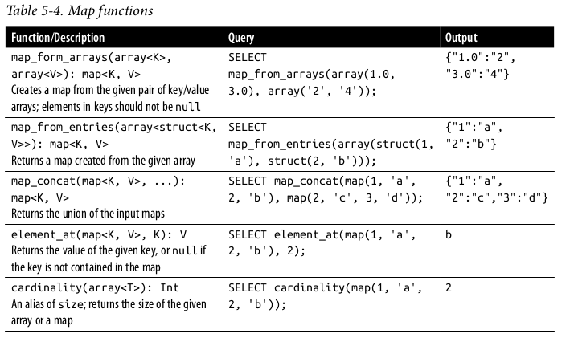

# Chapter 5 
## Spark SQL and DataFrames : Interacting with External Data Sources

In this chapter we will see how Spark SQL interfaces with the external components. Spark SQL allows you to 

- Use user-defined functions for both Apache Hive and Apache Spark 
- Connect with the external data sources like JDBC and SQL databases, PostgreSQL, MySQL, Tableau, Azure Cosmos DB and MS SQL Server 
- work with simple and complex types,higher-order functions and common relational operations 
  
## Spark SQL and Apache Hive 
Spark SQL is a fundamental component of Apache Spark that integrates relational processing with Spark's functional programming API. It was built on Shark which demonstrates that it was possible to have the enterprise data warehouse and scaling as the Hive/Map Reduce.

Spark SQL provides benefits of faster performance and relational programming (declarative queries and optimized storage)

## User Defined Functions 
 we can create our own function using spark (UDF) capability.

### Spark SQL UDF
We can create our own PySpark or Scala UDF which can be used in the Spark SQL without going through the inner working of the model. 

Example:

```
// In scala 
val cubed = (s : Long) => {
    s*s*s
}

// Register UDF 
spark.udf.register("cubed", cubed)

// Create a temp view 
spark.range(1,9).createOrReplaceTempView("udf_test")

# In python 
from pyspark.sql.types import LongType 

# Create cubed function 
def cubed(s):
    return s*s*s

# Register UDF 
spark.udf.register("cubed", cubed, LongType()) 

# Generate temp view 
spark.range(1,6).createOrReplaceTempView("udf_test")

# Now we can run these queries in the SparkSQL 

// In Scala/Python 
// Query the cubed UDF 
spark.sql("SELECT id, cubed(id) AS id_cubed FROM udf_test") 
```
#### Evaluation order and null checking in Spark SQL 
Spark SQL (includes SQL, DataFrame API and the Dataset API) doesn't guarantee the order of evaluation of the sub-expression. For example when we run the following query it doesn't guarantee that the `s is NOT NULL` clause is executed prior to the `strlen(s) > 1`

`spark.sql.("SELECT s FROM test1 WHERE s IS NOT NULL AND strlen(s) > 1")`

To perform a proper null checking, it is recommended that you do the following : 

1. Make the UDF itself null aware and do null checking inside the UDF 
2. Use IF or CASE WHEN expression to do the null check and invoke the UDF in a conditional branch 

#### Speeding up and distributing PySpark UDFs with Pandas UDFs 
Pandas UDFs provides faster performance than the normal PySpark UDFs. It used the Apache Arrow format to transfer the data without need of serialize/pickle the data. Instead of operating on individual row by row, we can operate it on a Pandas Series or DataFrame (a vectorized operation)

From Spark 3.0 with Python 3.6. Pandas UDFs were split into two API catagories: Pandas UDF and Pandas Function APIs 

- **Pandas UDFs**
  - With Spark 3.0 Pandas UDFs infer the Pandas UDF type from Python type hints in Pandas UDFs such as `pandas.series.pandas.DataFrame, Tuple and Iterators`. It supports cases in python for type hinting Pandas UDF from Series to Series, Iterator of Series to Iterator of Series, Iterator of Multiple Series to Iterator of Series and Series to Scalar
- **Pandas Function APIs**
  - Pandas Function API allows directly to apply a local Python function to a PySpark DataFrame where both the input and output are Pandas instances. Grouped map, map and co-grouped map 

```
# In Python 
# Import Pandas 
import pandas as pd 
# import various pyspark SQL functions including pandas_udf 
from pyspark.sql.functions import col, pandas_udf 
from pyspark.sql.types import LongType 

# Declare the cube function 
def cubed(a : pd.Series) -> pd.Series:
    return a*a*a

# Create the pandas UDF for the cubed function 
cubed_udf = pandas_udf(cubed , returnType = LongType())

# Create Pandas Series 
x = pd.Series([1,2,3])

print(cubed(x))

df = spark.range(1,4)

# Execute the function as a Spark vectorized UDF 
df.select("id", cubed_udf(col("id"))).show()

```
Using a vectorized UDF will result in the execution fo the Spark jobs. The previous local function is a pandas function executed only on a Spark driver. We can see in DAG visualization 



Like many Spark jobs, the job start with the `parallelize()` to send local data to executors and calls `mapPartitions()` to convert the Arrow binary batches to Spark's internal data format, which can be distributed to Spark workers. The number of `WholeStageCodegen` steps, which represent a fundamental step up in performance. But it is the ArrowEvalPython step that identifies that a Pandas UDF is being executed. 

## Querying with the Spark SQL Shell, Beeline, and Tableau

### Spark SQL 
To start the Spark CLI, execute the following command 
` ./bin/spark-sql`

#### Create a table 
`spark-sql> CREATE TABLE people (name STRING, age int);`

#### Insert data 
`INSERT INTO people SELECT name, age FROM ...`

#### Running Spark SQL query 
`SHOW TABLE;`

### Working with Beeline 
Beeline is a Hive QL CLI which has the JDBC server connection 

We can start the thrift server using command 
`./sbin/start-thriftserver.sh`

#### Execute spark SQL query with Beeline 

`SHOW tables` 

#### Stop the Thrift Server 
`./sbin/stop-thriftserver.sh`

### Working with Tableau 
We can connect Tableau using the thriftserver and using the UI connection guide to connect with Spark SQL 

## External Data Sources 
We can use the Spark SQL to connect to external data sources, starting with JDBC and SQL databases 

### JDBC and SQL Databases 
Spark SQL includes a data source API that can read data from other databases using JDBC. It simplifies querying these data sources as it return the result in DataFrame, thus providing all the benefits of Spark SQL. 

We can use following command for connecting database with JDBC 
`./bin/spark-shell --driver-class-path $database.jar --jars $database.jar`

Using data source API, the table from remote database can be loaded as a DataFrame or Spark SQL temporary view. User can specify the JDBC connection properties in the data source options.  

 
#### Importance of partitioning 

For large amount of data transfer between Spark SQL and  a JDBC external source, it is important to partition. All data goes to one driver connection which can saturate and significantly slow down the performance of the extraction. For large scale operation it is highly recommended to use the properties given below 


Example 
- numPartition: 10
- lowerBound: 1000
- upperBound: 10000

The stride is equal to 1000 and 10 partition will be created. This is the equivalent of executing these 10 queries

- SELECT * FROM table WHERE partitionColumn BETWEEN 1000 and 2000
- SELECT * FROM table WHERE partitionColumn BETWEEN 2000 and 3000
- ...
- SELECT * FROM table WHERE partitionColumn BETWEEN 9000 and 10000
There all following things should be keep in mind when using partitioning 
- The number of partition should be multiple of the number of Spark workers. For system with processing window we can maximize the concurrent request. However, for the system without the processing window like OLTP systems. We should reduce the number of concurrent request to present saturation of the source system. 

- Initially, calculate the `lowerBound` and `upperBound` based on the minimum and maximum `partitionColumn` actual values. If the most of the query is between 2000-4000 then there is no need of setting 1000 - 10000 range. 
- Choose the partition column uniformly distributed to avoid the data skewness. 
  
### PostgreSQL
To connect with the PostgreSQL database, build or download the JDBC jar from Maven and add it to classpath 

` bin/spark-shell --jars postgresql-42.jar `
Example to load from PostgreSQL 
```
// In Scala 
val jdbcDF1 = spark
    .read
    .format("jdbc")
    .option("url", "jdbc:postgresql:[DBSERVER]")
    .option("dbtable", "[SCHEMA].[TABLENAME]")
    .option("user", "[USERNAME]")
    .option("password", "[PASSWORD]")
    .load()
    // Read Option 2: Loading data from a JDBC source using jdbc method
// Create connection properties

import java.util.Properties
val cxnProp = new Properties()
    cxnProp.put("user", "[USERNAME]")
    cxnProp.put("password", "[PASSWORD]")
// Load data using the connection properties
val jdbcDF2 = spark
    .read
    .jdbc("jdbc:postgresql:[DBSERVER]", "[SCHEMA].[TABLENAME]", cxnProp)
// Write Option 1: Saving data to a JDBC source using save method
jdbcDF1
    .write
    .format("jdbc")
    .option("url", "jdbc:postgresql:[DBSERVER]")
    .option("dbtable", "[SCHEMA].[TABLENAME]")
    .option("user", "[USERNAME]")
    .option("password", "[PASSWORD]")
    .save()
// Write Option 2: Saving data to a JDBC source using jdbc method
jdbcDF2.write
    .jdbc(s"jdbc:postgresql:[DBSERVER]", "[SCHEMA].[TABLENAME]", cxnProp)

# In Python
# Read Option 1: Loading data from a JDBC source using load method
jdbcDF1 = (spark
    .read
    .format("jdbc")
    .option("url", "jdbc:postgresql://[DBSERVER]")
    .option("dbtable", "[SCHEMA].[TABLENAME]")
    .option("user", "[USERNAME]")
    .option("password", "[PASSWORD]")
    .load())
# Read Option 2: Loading data from a JDBC source using jdbc method
jdbcDF2 = (spark
    .read
    .jdbc("jdbc:postgresql://[DBSERVER]", "[SCHEMA].[TABLENAME]",
properties={"user": "[USERNAME]", "password": "[PASSWORD]"}))
# Write Option 1: Saving data to a JDBC source using save method
(jdbcDF1
    .write
    .format("jdbc")
    .option("url", "jdbc:postgresql://[DBSERVER]")
    .option("dbtable", "[SCHEMA].[TABLENAME]")
    .option("user", "[USERNAME]")
    .option("password", "[PASSWORD]")
    .save())
# Write Option 2: Saving data to a JDBC source using jdbc method
(jdbcDF2
    .write
    .jdbc("jdbc:postgresql:[DBSERVER]", "[SCHEMA].[TABLENAME]",
    properties={"user": "[USERNAME]", "password": "[PASSWORD]"}))

```
### MySQL 
To connect with Mysql, build or download the JDBC from Maven or MySQL and add it to class path. Then start a Spark Shell (or pyspark)
`bin/spark-shell --jars mysql-connector-java_8.0.16.jar`
Example Scala and python
```
// In Scala
// Loading data from a JDBC source using load
val jdbcDF = spark
.read
.format("jdbc")
.option("url", "jdbc:mysql://[DBSERVER]:3306/[DATABASE]")
.option("driver", "com.mysql.jdbc.Driver")
.option("dbtable", "[TABLENAME]")
.option("user", "[USERNAME]")
.option("password", "[PASSWORD]")
.load()

// Saving data to a JDBC source using save
jdbcDF
.write
.format("jdbc")
.option("url", "jdbc:mysql://[DBSERVER]:3306/[DATABASE]")
.option("driver", "com.mysql.jdbc.Driver")
.option("dbtable", "[TABLENAME]")
.option("user", "[USERNAME]")
.option("password", "[PASSWORD]")
.save()
And here’s how to do it in Python:
# In Python
# Loading data from a JDBC source using load
jdbcDF = (spark
.read
.format("jdbc")
.option("url", "jdbc:mysql://[DBSERVER]:3306/[DATABASE]")
.option("driver", "com.mysql.jdbc.Driver")
.option("dbtable", "[TABLENAME]")
.option("user", "[USERNAME]")
.option("password", "[PASSWORD]")
.load())
# Saving data to a JDBC source using save
(jdbcDF
.write
.format("jdbc")
.option("url", "jdbc:mysql://[DBSERVER]:3306/[DATABASE]")
.option("driver", "com.mysql.jdbc.Driver")
.option("dbtable", "[TABLENAME]")
.option("user", "[USERNAME]")
.option("password", "[PASSWORD]")
.save())
```
### Azure and MS SQL server 
we can refer to the guide

## Higher-order Functions in DataFrames and SparkSQL 
There are tow typical solutions for manipulating complex data types 
1. Exploding the nested structure into rows, applying some function then re-creating the nested structure 
2. Building a user-defined function 

#### Option 1 : Explode and Collect 
In nested SQL statement, we first `explode(values)`, which creates a new row (with the id) foe each element `(value)` within values. 

```
-- In SQL 
SELECT id, collect_list(value + 1) As values
FROM (SELECT id, EXPLODE(values) AS value
    FROM table) x 
GROUP BY id 


```
While collect_list() returns a list of objects with duplicates, the GROUP BY statement requires shuffle operations, meaning the order of the re-collected array isn't the necessarily same as the original array. A value could be any number of dimensions so GROUP BY will be very expensive. 

#### Option 2 : User-Defined Function 
Top perform the same task (adding 1 to each element in values), we can also create a UDF that uses map() to iterate through each element (value) and perform the addition operation 
```
-- In SQL 
SELECT id, collect_list(values + 1) as values
FROM (SELECT id, EXPLODE(values) AS value
    FROM table) x
GROUP BY id 
```
We can use then this UDF in Spark SQL as follows 

`spark.sql("SELECT id, plusOneInt(value) AS values FROM table").show()`

While this is better than using `explode()` and `collect_list()` as there won't be any ordering issue, the serialization and deserialization process itself may be expensive. It is also important to note, however, the `collect_list()` may cause executors to experience out-of-memory issue for large data sets, whereas using UDFs would alleviate these issues. 

#### Built-in Complex Data Types 
We can use following build in functions for complex data types 





## Higher-Order Functions 
Apart from the built-in functions, there are higher-order functions that take anonymous lambda functions as argument. 
```
-- In SQL 
transform(values, value -> lambda_expression)

```
The `transform()` function takes an array (values) and anaonymous function (`lambda` expression) as input. The function transparently create a new array by applying the anonymous function to each element, and then assigning the result to the output array

```
# In python 
from pyspark.sql.types import * 
schema = StructType([StructField("celsius", ArrayType(IntegerType()))])

t_list = [[35,36,54,94,84,51,21,]], [[31,32,34,35,36]]
t_c = spark.createDataFrame(t_list, schema)
t_c.createOrReplaceTempView("tC")

# Show the DataFrame 

t_c.show()

// In Scala 
// Create DataFrame with two rows of two arrays (tempc1, tempc2)
val t1 = Array(35,36,32,30,40,42,38)
val t2 = Array(31,32,34,55,56)
val tC = Seq(t1,t2).toDF("celsius")
tC.createOrReplaceTempView("tC")

// Show the DataFrame 
tC.show()

```
### transform()
`transform(array<T>, function<T, U>) : array <U>`
The `transform()` function produces an array by applying a function to each element of the input array 

```
// In scala /Python n
// Calculate Fahrenheit from Celsius fro an array of temperatures 
spark.sql("SELECT celsius, transform(celsius, t -> ((t * 9) div 5) + 32) as fahrenheit FROM tC").show()

```
### filter()
`filter(array<T>, function<T, Boolean) : array<T>`

The `filter()` function produces an array consisting of only elements of the input array for which the Boolean function is true 

```
// In Scala/Python 
// Filter temperatures > 38C for array of temperatures 
spark.sql("""
SELECT celsius, 
filter(celsius, t -> t > 38) as high 
FROM tC 

""").show()
```
### exists()
`exists(array<T>, function<Tm V, Boolean>) : Boolean`
The `exists()` function returns true if the Boolean functions holds for any element in the input array: 
```
// In Scala and Python 
// Is there a temp of 38C in the array of temrature 
spark.sql(
    """ 
    SELECT celsius, 
    exist(t -> t = 38) as threshold
    FROM tC 
).show()
```
### reduce()
`reduce(array<T>, B, function<B,T,B>, function<B,R>`
The `reduce()` function reduces the element of the array to a single value by merging the elements into a buffer B using function <B, T, B> and applying a `function<B, R>` on the final buffer. 
```
spark.sql(
    """
    SELECT celsius,
        reduce(
            celsius, 
            0,
            (t, acc) -> t + acc, 
            acc -> (acc div size(celsius) * 9 div 5) + 32
        ) as avgFahrengeit 
        FROM tC 

    """
).show()

```
## Common DataFrame and SparkSQL Operations 
