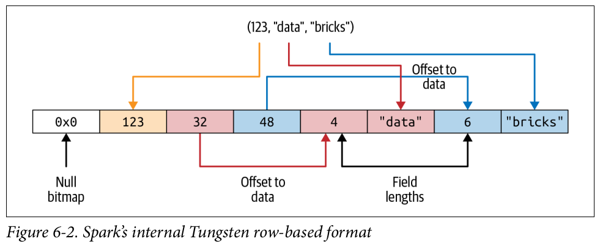
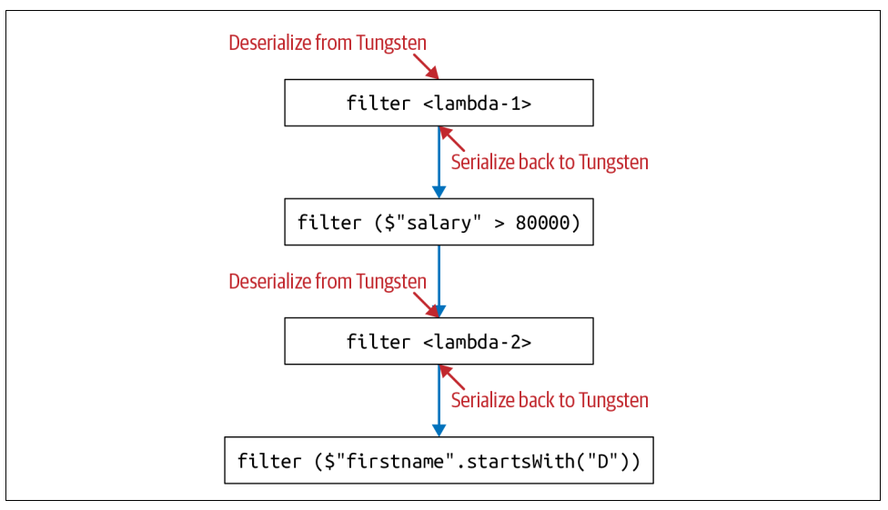

# Chapter 6
## Spark SQL and Datasets 

In this chapter we will explore the working with Datasets in Java and Scala, how spark manages memory to accommodate Dataset constructs as part of the high-level API, the costs associated with using Datasets 

## Single API for Java and Scala 
Datasets offer a unified and singular API for strongly typed object. Among the languages supported by Spark only Scala and java are strongly typed, hence, Python and R support only the untyped DataFrame API 

Datasets are domain-specific typed objects that can be operated on in parallel using functional programming or the DSL operators. It has singular API for Scala and Java for both implementation. 

## Scala Case Classes for Datasets 
Spark has internat datatype such as *String Type, BinaryType, IntegerType, BooleanType and MapType*, that iti used to map seamlessly with the language-specific data types in Scala and Java during Spark operations. This mapping is done via encoders 
 
In order to create Datasets[T], where T is the typed object in Scala, we need case class that defines the Object. To create a distributed Dataset[Bloggers]. We must first define a Scala case class that defines each indivisual field that comprises a Scala object. This case class serves as a blueprint or schema for the typed object *Blogger*. 

Example 
```
// In Scala 
case class Bloggers(id: Int, first: String, last: String, url:String, data:String, hits:Int, campaigns: Array[Strings])

// Read data 
val bloggers = "file_path/bloggers.json"
val bloggersDS = spark
    .read
    .format("json")
    .option("path", bloggers)
    .load()
    .as[Bloggers]

```
In Datasets we have to define the types and schema in advance, unlike DataFrame it can't infer the Schema by its own. 

We can also use the existing Scala case class to match the input data. Working with Dataset API is as easy, concise and declarative like DataFrames. 

## Working with Datasets 
One simple way to create a sample Dataset is using *SparkSession* instance. We will dynamically create a Scala object with *uid, uname and usage*

### Creating Sample Data 
```
// In Scala 
import scala.util.Random._ 
// Our case class for the Dataset 
case class Usage(uid: Int, uname: String. usage:Int)
val r = new scala.util.Random(42)
// Create a 1000 instances of scala usage class
// Generates on the fly
val data = for (i <- 0 to 1000)
yield (Usage(i, "user-" + r.alphanumeric.take(5).mkString(""). r.nextInt))
// Create a Dataset of Usage typed data 
val dsUsage = spark.createDataset(data)
dsUsage.show()

```
### Transforming Sample Data 
Datasets are strongly typed collections of domain-specific objects. These objects can be transformed in parallel using functional or relational operations. 
Example of these transformation includes *map(), reduce(), filter(), select(), aggregate()*. Like higher-order-functions these methods can take lambdas, closures or functions as arguments and return the results. They lend themselves well to functional programming 

We can try higher-order functions in Spark and use functional programming construct with the sample data we create earlier 

#### Higher-order functions and functional programming 

Let use *filter()* to return all the users in dsUsage Dataset whose usage exceeds 900 minutes. We will use filer method
```
// In Scala 
import org.apache.spark.sql.functions._ 
dsUsage
    .filter(d => d.usage > 900)
    .orderBy(desc("usage"))
    .show(5, false)
```
```
def filerWithUsage(u : Usage) = u.usage > 900
dsUsage.filter(filterWithUsage(_)).orderBy(desc("usage")).show(5)

```
In both cases the *filter()* method takes the argument of lambda expression and Scala function and iterates over rows to complete the operation. 

We can also use *map()* higher order function to return a value 

```
// In Scala 
// Use an if-then-else lambda expression and compute a value 

dsUsage.map(u => {if (u.usage > 750) u.usage*0.15 else u.usage*0.50}).show(5,false)

def computeCostUsage(usage: Int): Double = {
    if (usage > 750) usage * 0.15 else usage * 0.50
}
// Use function as argument 
dsUsage.map(u => {computeCostUsage(u.usage)}).show(5, false)
```
We have computed values for the cost of usage, we don't know which users the computed values are associated with it
We can use following steps for the solution 
1. Create a case class in Scala with an additional field or column named cost. 
2. Define a function to compute the cost and use it in the *map()* method. 

```
// In Scala
// Create a new case class with an additional field cost 

case class UsageCost(uid: Int, uname: String, usage: Int, cost: Double)

// Compute a usage cost with Usage as a parameter 
// Return a new object, USageCost 

def computeUserCostUsage(u: Usage) : UsageCost = {
    val v = if (u.usage > 750) u.usage * 0.15 else u.usage * 0.50
    UsageCost(u.uid, u.uname, u.usage, v)
}

// Use map on our original Datasets
`dsUsage.map(u => {computeUserCostUsage(u)}).show(5)`
```
#### Converting DataFrames to Datasets
We can convert DataFrames to Datasets by using the case class notation `df.as[SomeCaseClass]`. 
```
// In Scala 
val bloggerDS = spark
    .read
    .format("json")
    .option("path", "/data/bloggers")
    .load()
    .as[BLoggers]
```
## Memory Management for Datasets and DataFrames 
Spark is an intensive in-memory distributed big data engine, so its important to use memory efficiently for performance. 
- In Spark 1.x Project Tungsten introduced which lays our row-based format for Datasets and DataFrames in off-heap memory using offsets and pointers. Spark uses `encoders` to serialize and deserialize between the JVM and internal Tungsten format. 
- Spark 2.x introduced second generation Tungsten engine featuring whole-stage code gneration and vectorized column-based memory layout. It uses Single instruction, multiple data (SIMD) approach. 

## Dataset Encoders 
Encoders convert data in off-heap memory from Spark's internal Tungsten format to JVM Java Objects. They serialize and deserialize Dataset object from Spark internal format to JVM objects, including primitive data types. an Encoder[T] with covert from Spark inter

### Spark internal Format vs Java Object Format 
Instead of creating JVM-based objects for Datasets or DataFrames, Spark allocates
off-heap Java memory to lay out their data and employs encoders to convert the data
from in-memory representation to JVM object.nal Tungsten format to Dataset[T]. 

### Serialization and De-serialization 
It is used for distributed computing for sending data over nodes in a cluster. Serialization and de-serialization is a process when data is *encoded(serialized)* into binary representation or format by the sender and *decoded(de-serialized)* from binary to respective data-typed object by the receiver. 

Java native encoder is slow so Dataset encoders are used for few reasons
- Spark Tungsten binary format stores object off-heap Java memory and it's compact to those object occupy less space 
- Encoders can be quickly serialized by traversing across the memory using simple pointer arithmetic with memory address and offsets. 
- On receiving end, encoders can quickly deserialize the binary representation into Spark internal representation. Encoders are not hindered by Java garbage collection pause. 


## Cost of using Datasets 
Datasets also come with some cost associated during deserializing from Spark internal Tungsten format to JVM object. For large data sets and many queries this will have impact on the performance. 

### Strategies to Mitigate Costs 
One strategy to mitigate the cost is to use DSL expression, the lambda as anonymous functions as argument to higher-order functions. Because they are anonymous they and opaque to Catalyst optimizer until runtime, it can't be optimize properly. 

Second is chaining the queries to reduce Ser-and-De-Ser.
```
// In Scala 
Person(id: Integer, firstName: String, middleName: String, lastName: String, gender: String, birthDate: String, ssn: String, salary: String)

// example of inefficient query 

import java.util.Calendar 

val earliestYear = Calendar.getInstance.get(Calendar.YEAR) - 40

personDS 
    // Everyone above 40 : lambda 1
    .filter(x => x.birthDate.split("-)(0).toInt > earliestYear)

    // Everyone earning above 80K 
    .filter($"salary" > 80000) 
    
    // Last name starts with J: lambda-2
    .filter(x => x.lastName.startsWith("J"))
    // First name starts with D
    .filter($"firstName".startsWith("D"))
    .count()


```

It repeatedly doing Ser and De-Ser, iti si much better not to use lambda and use DSL to avoid the overhead. 

```
personDS
.filter(year($"birthDate") > earliestYear) // Everyone above 40
.filter($"salary" > 80000) // Everyone earning more than 80K
.filter($"lastName".startsWith("J")) // Last name starts with J
.filter($"firstName".startsWith("D")) // First name starts with D
.count()

```


