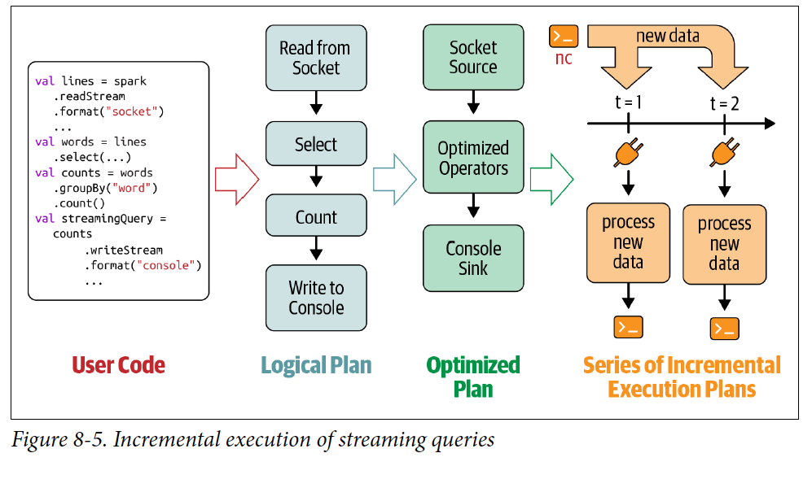
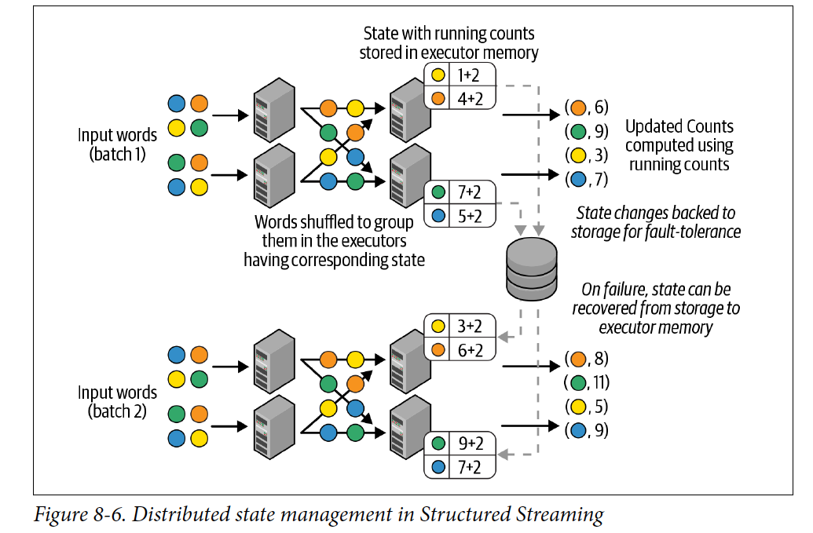
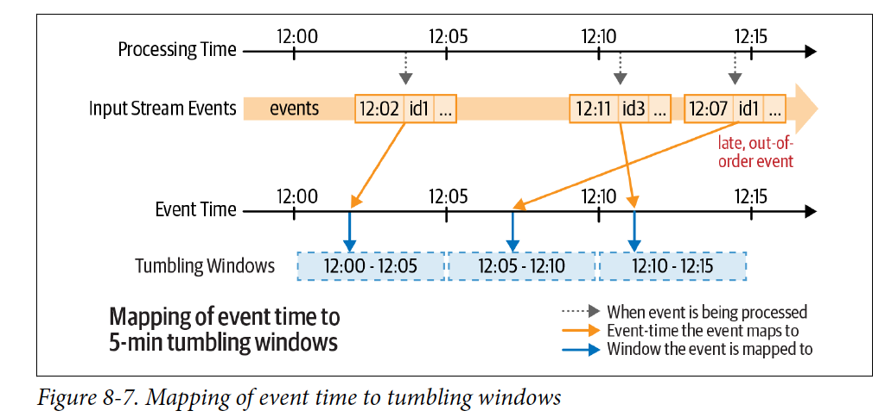
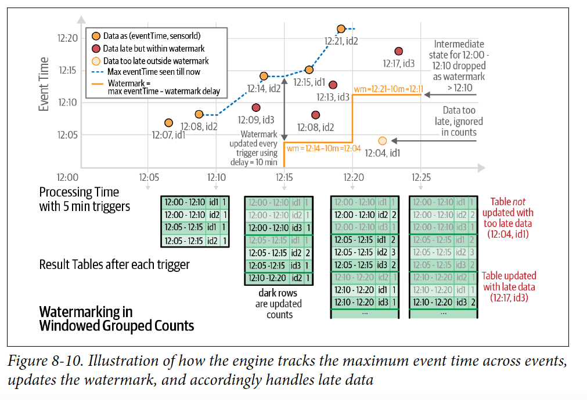

# Chapter 8
## Structured Streaming

In this chapter we will read about continuos streamed data.

### Evolution of the Apache Spark Stream Processing Engine 
The traditional stream processing method was *record-at-a-time* but due to slow recovery of the failure some new methods have been used. 

### Micro-Batch Stream Processing 
In *Micro-Batch-Stream Processing* the data is computed in a series on continuous of small map/reduce style batch processing jobs small chunks of the stream data. 


It divides a streaming data into small batches which helps to perform distributed manner and provides micro-batches outputs. This has following advantages. 
- It is fault tolerate and easy to recover by making multiple copies of the data
- It provides guarantee of end-to-end exactly one processing of the data due to ensuring the output data is same during re-execution 

It has overhead of latency as it can't provide millisecond-level latency but can provide the latency of few seconds. While it is not a fully stream like service but it has many advantage with its micro-batch processing. Most of the streaming pipeline have at-least one of the characteristics. 

- The pipelines doesn't need latency lower than a dew seconds. 
- There are already other larger delay exists in pipeline. For example, 

The DStream API was built upon Spark's batch RDD API. DStream had the same functional semantics and fault-tolerance model as RDDs. It makes it a unified processing engine to provide consistent API and semantics for batch, interactive and streaming workloads. This fundamental paradigm shift in stream processing makes Spark streaming a most widely used open source stream processing engines. 

## Lesson learned from the Spark Streaming (DStream)

There are following improvement have been made to the DStream 

- Made a unified single API for all the batch jobs 
- No need to hand optimization after creating separation between the logical and physical plans 
- It has native support for the event-time windows which makes easy to build the data pipelines for the developers 

## The Philosophy of Structured Streaming 

A new DStream, Structured Streaming was designed from scratch with one core philosophy - writing of stream processing should be as easy as writing the batch processing. The guiding principles of Structured Streaming are 

- A single unified programing model and interface for both batch and stream processing. It makes simple to query to SQL like batch processing in stream processing without getting worried about the underlying complexities. 
- A broader definition of stream processing. Any application that periodically to continuously processes data should be expressible using Structured Streaming 

## A Programming Model of Structured Streaming 

Structured Streaming extends the Table concept to streaming as unbounded table with continuous appended Table 

 
 The Structured Stream doesn't retain the data while it creates a static table with T duration of the data and it applied as a batch job on the table. 
 The developer define a query on this conceptual input table, as if it were a static table, to compute the result table that will be written to an output sink. Structured streaming will automatically convert this batch-like query to a stream execution plan. This is called *incrementalization*: Structured Streaming figures out what state needs to be maintained to update the result each time a record arrives. Finally, developers specify triggering policies to control when to update result. Each time a triggers fires, Structured Streaming check for new data and incrementally updates the result. 


For the output part of the model. Each time the result table is updated, the developer will want to write updates to an external systems, such as filesystem (HDFS, Amazon S3) or a database(MySQL, Cassandra). We usually want to write output incrementally. Structured Streaming provides three output modes: 

- **Append Mode** Only the new rows appended to the result table since the last trigger will be written to the external storage. This is application only in queries where the existing rows in the result cannot be change. 
- **Update Modes** Only the rows that were updated in the result table since the last trigger will be changed in the external storage. This mode works for the output sinks that can be updated in place, such as MySQL Table 
- **Complete Modes**The entire updated result table will be written to external storage

## The Fundamentals of a Structured Steaming Query 
We are going to cover some high-level concepts that we'll need to understand to develop Structured Streaming queries. We will define and start a streaming query, then we will discuss how to monitor the active query and manage its life cycle. 

### Five Steps to Define a Streaming Query

-**Step1 Define inputs sources** : As with batch queries, the first step is to define a DataFrame from a streaming source. For spark stream we can use `spark.readStream` to create `DataStreamReader.DataStreamReader` has most of the same methods as `DataFrameReader`

Example 
```
# In Python 
spark = SparkSession...
lines = (spark
    .readStream.format("socket")
    .option("host", "localhost")
    .option("port", 9999)
    .load())
```
The code generates the lines DataFrame as an unbounded table of newlines separated text data from local:9999, it only setup the configurations for the Stream but doesn't fetch the data until executed. Besides sockets Apache Spark natively supports reading data streams from Apache Kafka and all the various file-based formats that `DataFrameReader` supports (Parquet, ORC, JSON). The streaming query can define multiple input sources, both streaming and batch, which can be combined using DataFrame operations like unions and joins. 

- **Step 2 Transform Data** : Now we can apply the usual DataFrame operations, such as splitting the lines into individual words and them counting them 
```
# In python 
from pyspark.sql.functions import *
words = lines.select(split(col("value", "\\s").alias("word")))
counts = words.groupBy("word").count()
```
Here count is a *streaming* DataFrame that represents the running word counts that will be computed once the streaming query is started and the streaming input data is being continuously processed. These work exactly the same ways if the *lines* were a DataFrame. 
There are two classes of data transformation 

- Stateless Transformation
  - Operation like `select(), filter(), map()` do not require any information from previous rows to process the next row; each row can be processed by itself. The lack of previous state in these operation makes them stateless. Stateless operation can be applied to both batch and streaming DataFrames 
- Stateful Transformation 
  - An aggregation operation like `count()` requires maintaining state to combine data across multiple rows. Any DataFrame operation that requires grouping, joining or aggregating are stateful transformations. Many of them are supported by Streaming but some of them are computationally hard or infeasible to compute them in an incremental manner. 
- **Step 3: Define output sink and output mode** : After transforming the data, we can define how to write the processed output data with `DataFrame.writeStream`. This create a `DataStreamWriter` which, similar to DataFrameWriter, has additional methods to modify. 
  - Output writing details (where and gow to write the output)
  - Processing details (how to process data and how to recover from the failures)
```
# In Python 
writer = count.writeStream.format("console").outputMode("complete")
```
Here we have specified "console" as the output as the streaming sink and "complete" as the output mode. The output mode of the a streaming query specifics what part of the updated output to write out after processing new input data. 
- Append Mode
  - This the default mode, only the new rows added to the result table/DataFrame since the lst trigger will be output to that sink. Semantically, this mode guarantees that any row that is output is never going to changed or updated by the query in the future. Append mode support only those queries that will never modify previously output data. The word count query can update previously generated counts; therefore, it does not support append mode. 
- Complete Mode
  - In this model, all the roes of the result table/DataFrame will be output at the end of every trigger. This is supported by queries where the result table is likely to be much smaller than the input data and therefore can feasibly be retained in memory. Our word count query supports complete mode because the counts data is likely to be far smaller than the input data. 
- Update mode
  - In this model, only rws of the result table/DataFrame that were updated since the last trigger will be output at the end of the trigger. This is in contrast to append mode, as the output rows may be modified by the query and output again in the future. Most queries support update mode. It can write to Apache Kafka streams using `foreachBatch()` and `foreach()` API. 
- **Step 4: Specify processing details**
  - The final step before starting the query is to specify the details of how to process the data. 
  ```
  checkpointDir = "..."
  writer2 = (writer
    .trigger(processingTime = "1 second")
    .option("checkpointLocation", checkpointDir))
  ``` 
  Here we have specified two details using the `DataStreamWriter` that we created with `DataFrame.writeStream`

- Triggering details 
  - This indicates when to trigger the discovery and processing of newly available streaming data. There are four options: 
    - Default 
      - When the trigger is not explicitly specified, then by default, the streaming query executes data in micro-batches where the next micro-batch is triggered as soon as the previous micro-batch has completed 
    - Processing time with trigger interval
      - We can explicitly define the ProcessingTine trigger with an interval and the query will trigger micro-batches at that interval
    - Once 
      - In this mode, the streaming query will execute exactly one micro batch, it processes all the new data available in a single batch then stops itself. This is useful when we want to control the triggering and processing from an external schedular that will restart the query using any custom schedule. 
    - Continuous 
      - This is an experimental model, where the streaming query will process data continuously instead on micro-batches. Only a small DataFrame operation will be allowed in this mode but it can provide much lower latency thant the micro batch trigger modes. 
  - Checkpoint locations 
    - This is a directory in any HDFS compatible filesystem where the streaming query saves its progress information - that is, what data has been successfully processed. Upon failure, this metadata is used to restart the failed query exactly where it left off. Therefore, setting this option is necessary for failure recovery with exactly-once guarantees. 
- **Step 5 : Start the Query** : We can do following to start the query 
  - ``` streamingQuery = writer2.start()``` *start()* isa non-blocking method it will return as soon as the query has started in background we can use `streamingQuery.awaitTermination()` to block the main thread until the query terminates. We can use `awaitTermination(timeoutMillis` for timeout and `streamingQuery.stop()` to stop the query. 
  - 
### Putting it all 
```
# In python 
from pyspark.sql.functions import *
spark = SparkSession...
lines = (spark
    .readStream.format("socket")
    .option("host", "localhost")
    .option("port", 9999)
    .load())

words = lines.select(split(col("value"), "//s").alias("word"))
counts = words.groupBy("words").count()
checkpointDir = "..."
streamingQuery = (counts
    .writeStream
    .format("console")
    .outputMode("complete")
    .trigger(processingTine = "1 second")
    .option("checkpointLocation", checkPointDit)
    .start())
streamingQuery.awaitTermination()


```

## Under the Hood of an Active Streaming Query 
Once the query starts following sequence of steps takes place. The DataFrame Operation are converted into the logical plan, which is an abstract representation of the computation the Spark SQL uses to plan a query 
1. Spark SQL analyzes and optimizes this logical plan to ensure that it can be executed incrementally and efficiently on streaming data 
2. Spark SQL starts a background thread that continuously executes the following loops
   1. Based on the configured trigger interval, the thread checks the streaming sources for the availability of new data 
   2. If new data comes it is executed in micro-batches. From the optimized logical plan, an optimized Spark execution plan is generated that reads the new data from the sources, incrementally computes to the configured output mode. 
   3. For every micro-batch, the exact range of data processed and any associated state are saved in the configured checkpoint location so that the query can deterministically reprocess the exact range if needed 
3. The loop continues until the query is terminated, which can occur for one of the following reasons
   1. A failure has occurred in the query(processing error in the cluster)
   2. The query is explicitly stopped using streamingQuery.stop()
   3. The trigger is set to Once, then the query will stop on its own after executing a single micro-batch containing all the available data.
   

## Recovering from Failures with Exactly-Once Guarantees 
To restart a terminated query in a completely new process, we have to create a new `SparkSession`, redefine all the DataFrames, and start the streaming query on the final result using the same checkpoint location as the one used last time. The checkpoint location must be same across restarts because this directory contains the unique identity of a streaming query and determines the life cycle of the query. The checkpoint location contains vital information about the last executed micro-batch, this provides Structured Streaming ensured `end-to-end-exactly-once guarantees`. 
There are following conditions needs to be satisfied.
- Replayable streaming sources
  - The data range of the last incomplete micro-batch can be reread from the sources. 
- Deterministic computations 
  - All the data transformations deterministically produce the same result when given the same input data. 
- Idempotent streaming sink 
  - The sink can identify re-executed micro-batches and ignore duplicate writes that may be caused by restarts 
The word count example does not provide exactly one guarantees because the socket source is not replayable and the console sink is not idempotent. 

We can make minor modification between restarts 

- DataFrame transformations
  - If we want to ignore lines that have corrupted byte sequences that can crash the query, we can add a filter in the transformation 
  ``` # In python 
      # is CorruptedUdf = udf to detect corruption in string 

      filteredLines = lines.filter("isCorruptedUdf(value) = false")
      words = filteredLines.select(split(col("value"), "//s").alias("word"))


  ``` 
After restart the query will be filtered 

- Source and sink options 
  - Whether a readStream or writeStream option can be changed between restarts depends on the semantics of the specific source or sink. For example, we should not change the host and port option for the socket source if data going to be sent to that host and port. 
  ``` writeStream.format('console').option("numRows", "100")```

- Processing details 
  - The checkpoint location must not be changed between restarts. However, other details like trigger interval can be changed without breaking fault-tolerance guarantees.

## Monitoring an Active Query 
We have several methods to track the status and processing metrics of an active query. 

### Querying current status using Streaming Query 
We can query current health of an quey using *StreamingQuery* instance. We have two methods 
1. **Get current metrics using StreamingQuery** : When a query process some data in a micro-batch, we consider it to have made some progress. *lastProgress()* returns information on the last completed micro-batch. 
2. **Get current status using StreamingQuery.status()** : This provides information on what the background query thread is doing at this moment. For example, printing the returned object will produce something like 
   ``` // In Scala/Python
    {
    "message" : "Waiting for data to arrive",
    "isDataAvailable" : false,
    "isTriggerActive" : false
    }

   ```
## Streaming Data Sources and Sinks 
We have covered the basic steps needed to express an end-to-end Structured Streaming Query, Now we will see how to built-in streaming data sources and sinks. 

### Files 
SS (Structured Streaming) supports writing data to and from files in plain text, CSV, JSON, Parquet, ORC. 

#### Reading from files 
SS can treat files written into a directory as a data stream. 
```
# In Python
from pyspark.sql.types import * 
importDirectoryOdJsonFiles = ...

fileSchema = (StructTypes()
  .add(StructField("key", IntegerType())))
  .add(StructField("value", IntegerType()))

inputDF = (spark
    .readStream
    .format("json")
    .schema(fileSchema)
    .load(inputDirectoryOfJsonFiles))

```
Few things to take in care if using a file 

- All the files must be in the same format and expected to have the same schema. 
- Each file must be appear in the directory listing atomically- it should not be modified or altered during and after the reading because the engine internally marks the file as read. Any changes to these file will not be processed
- It selects the files on the basis of time stamp in a micro batch, within a micro-batch it reads the files in parallel. 

#### Writing to files 
SS also support writing to files but only in append mode because it is hard to modify the existing data files. It also supports partitioning 
```
# In Python
outputDir = ...
checkpointDir  = ...
resultDF = ...

streamingQuery = (resultDF.writeStream
      .format("parquet")
      .option("path", outputDir)
      .option("checkpointLocation", checkpointDir)
      .start())

```

Point to remember 

- SS achieves end-to-end exactly-once guarantees when writing to files by maintaining a log of the data files that have been written to the directory. This log is maintained in the subdirectory *_spark_metadata*. Any Spark query on the directory will automatically use the load to read the correct set of data files so that the exactly-once guarantee is maintained.
- If we change the schema of the result DataFrames between restarts, them the output directory will have data in multiple schemas. These schemas have to be reconciled when querying the data. 
  
## Apache Kafka 

### Reading from Kafka 

To perform distributed reads from Kafka, we have to use options to specify gow to connect to the sources. 
```
# In Python 
inputDF = (spark
    .readStream
    .format("kafka"))
    .option("kafka.bootstrap.servers", "host1:port1, host2:port2")
    .option("subscribe", "events")
    .load())
  

```

### Writing to Kafka 
For writing to Kafka, SS expects the result DataFrame to have a few columns of specific names and types like 
key - string or binary, value - string or binary, topic - string

We can write to Kafka in all three output modes, through complete mode is not recommended as it will repeatedly output the same records. Here is the concrete example of writing the output of our earlier word count query into Kafka in update mode: 

```
# In python 
counts = ... #DataFrame[word: String, count: long]
streamingQuery = (counts
  .selectExpr(
    "cast(word as string) as key", 
    "cast(count as string) as value")
    .writeStream
    .format("kafka")
    .option("kafka.bootstrap.servers", "host1:port1, host2:port2")
    .option("topic", "wordCounts")
    .outputMode("update")
    .option("checkpointLocation", checkpointDir)
    .start())

```

## Custom Streaming Sources and Sinks 
When we do not have built-in support in SS. We will see how to used the *foreachBatch()* and *foreach()* methods to implement custom logic write to your storage. 

### Writing to any storage system 
There are two operation that allow you to write the output of a streaming query to arbitrary storage system : `foreachBatch()` and `foreach()`. The have slightly different use cases: while `foreach()` allows custom write logic on every row, `foreachBatch()` allows arbitrary operations and custom logic on the output of each micro-batch. 

**Using foreachBatch()** It allows us to specify a function that is executed on the output of every micro-batch of a streaming query. It takes two parameters: a DataFrame or Dataset that has the output of a micro-batch, and the unique identifier of the micro-batch. As an example, we want to write the output of out earlier word count query to Apache Cassandra. As of Spark Cassandra Connector there is no support for writing streaming DataFrames. But we can use the connector batch DataFrame support to write the output of each batch to Cassandra. 

```
# In Python 
hostAddr = "<ip address>"
keyspaceName = "<keyspace>"
tableName = "<tableName>"

spark.conf.set("spark.cassandra,connection.host", hostAddr)

def writeCountsToCassandra(updatedCountsDF, batchID):
# Use Cassandra batch data source to write the updated counts 
(updatedCountsDF
.write
.format("org.apache.spark.sql.cassandra")
.mode("append")
.options(table=tableName, keyspace=keyspaceName)
.save())

streamingQuery = (counts
  .writeStream
  .foreachBatch(writeCountsToCassandra)
  .outputMode("update")
  .option("checkpointLocation", checkpointDir)
  .start())


```

*Reuse existing batch data sources*

As shown in previous example, with *foreeachBatch()* we can use existing batch data sources to write the output of streaming queries 

*Write to multiple locations*

If we want to write the output of a streaming query to multiple locations, then we can simply write the output DataFrame/Dataset multiple times. However, each attempt to write can case the output data to be recomputed. To avoid the re-computation we should cache the *batchOutputDataFrame*, write it to multiple locations and then uncache it. 

```
#In Python 
def writeCountsToMultipleLocations(updatedCountsDF, batchId):
  updatedCountsDF.persist()
  updatedCountsDF.write.format(...).save() # Location 1
  updateCountsDF.write.format(...).save() # Location 2
  updatedCountsDF.unpersist()

```

*Apply additional DataFrame operations*

Many DataFrame API operations are ont supported on streaming DataFrames because SS does not support generating incremental plans in those cases. Using *foreachBatch()* we can apply these operation on each micro-batch. However, we will have to reason about the end-to-end semantics of doing operations ourself. 

**Using foreach()** If *foreachBatch()* is not an option, then we can express our custom writer logic using *foreach()*. Specifically we can express the data writing logic by dividing it into three methods: open(), process() and close(). SS will use these methods to write each partition of the output records. 

```
#In python 
# Variation 1 : Using function 
def process_row(row):
  # Write row to storage 
  pass 

query = streamingDF.writeStream.foreach(process_row).start()

# Variation 2 : Using the ForeachWriter class 

class ForeachWriter:
  def open(self, partitionId, epochId):
    # open connection to data store
    # Return True if write should continue 
    # This method is optional in python 
    # If not specified, the write will continue 
    return True 
  
  def process(self, row):
    # Write string to data store using opened connection 
    # This method is NOT optional in python
    pass 

  def close(self, error):
    # Close the connection. This method is optional in Python
    pass 

resultDF.writeStream.foreach(ForeachWriter()).start()


```

## Data Transformation 
We will see data transformation for the SS. There are two types of transformation in DataFrame SS. *Stateful* and *Stateless*. 

### Incremental Execution and Streaming State 
The Catalyst Optimizer in Spark SQL converts all the DataFrame operations to an optimized logical plan. The Spark SQL planner, which decides how to execute a logical plan, recognized that this is a streaming logical plan that needs to operate on continuos data streams. Accordingly, instead of converting the logical plan to a one-time physical execution plan, the planner generates a continuous sequence of execution plans. Each execution plan updates the final result DataFrames incrementally - that is, the plan processes only a chunk of new data from the input streams and possibly some intermediate, partial result computed by the previous execution plan. 

Each execution is considered as a micro-batch, and the partial intermediate results that is communicated between the executions is called the streaming "state". DataFrame operation are classified into stateless and stateful operation baed on whether executing the operation incrementally requires maintaining a state. We will explore the distinction between stateless and stateful operation and how their presence in a streaming query requires different runtime configuration and resource management. 

### Stateless Transformation 
All projection operation (`select(), explode(), map(), flatmap()`) and selection operation `filter(), where()` process each input record individually without needing any information from previous rows. This lack of dependence on prior input data makes them stateless operations. 

A streaming query having only stateless operations supports the append and update output modes, but not complete mode. This is because any processed output row of such a query cannot be modified by any future data, it can be written out to all streaming sinks in append mode. On the other hand, such queries naturally do not combine information across the records and therefore many not reduce the volume of data in the results. 

### Stateful Transformation 

The simplest example of stateful transformation is `DataFrame.groupBy().count()` which generates a running count of the number of records received since the begining of the query. In every micro-batch, the incremental plan adds the counts of new records to the previous count generated by previous micro-batch. This state is maintained in the memory of the Spark executors and is checkpoint to the configured location in order to tolerate failures. We need to tweak some knobs to configure the spark stateful operators to manage their state under the hood. 

#### Distributed and fault-tolerant state management 
Spark's scheduler running in thr driver breaks down our higher-level operation into small tasks and puts them in the task queues, and as the resource become available, the executors pull the task from the queues to execute them. Each micro-batch in a streaming query essentially performs one such set of tasks that read new data from streaming sources and write updated output to streaming sinks. For stateful stream processing queries, besides writing to sinks, each micros-batch of tasks generates intermediate state data which will be consumed by the next micro-batch. The state generation is completely partitioned and distributed, and it is cached in the executor memory for efficient consumption. Which shows how the state is managed in our original streaming word count query. 

SS ensures the correctness of the operation by automatically saving and restoring the state in a distributed manner. Depending on the stateful operation, all you may have to do is tune the state cleanup policy such that old keys and values can be automatically dropped from the cached state. 

#### Types of stateful operations 
The essence of streaming state is to retain summaries of past data. Sometimes old summaries need to be cleaned up from the state to make room for new summaries. We can distinguish two types of stateful operations. 

- **Managed Stateful Operation**
  The automatically identify and clean up old state, based on an operation specific definition of old. We can tune what is defined as old in order to control the resource usage. The operations that fall into this category are 
  - Streaming aggregation 
  - Stream-stream joins 
  - Streaming deduplication 
- **Unmanaged Stateful operations**
  The operation let us define out own custom state cleanup logic. The operations let us define our custom state cleanup logic. The operations in this category are
  - MapGroupWithState
  - FlatMapGroupsWithState 
  
## Stateful Streaming Aggregations 
SS can incrementally execute most DataFrame aggregation operation. We can aggregate data by keys and/or by time. We will discuss the semantics and operational details of tuning these different types of streaming aggregation along with some aggregations which are not supported also. 

### Aggregations Not Baed on Time 
Aggregation not involving time can be broadly classified into two categories

- *Global aggregation*
    Aggregations across all the data in the stream. For example, say we have a stream of sensor reading as a streaming DataFrame sensorReading. We can calculate the running count of the total number of reading received with following query. 
    ```
    # In Python
    runningCount = sensorReadings.groupBy().count()


    ```
- *Grouped Aggregations*
  Aggregations within each group or key present in the data stream. If sensorReadings contains data from multiple sensors, we can calculate the running average reading of each sensor
  ```
  # In Python 
  baselineValues = sensorReadings.groupBy("sensorId").mean("value")

  ```
It also supports `sum(), mean(), stddev(), countDistinct(), collect_set(), approx_count_distinct()`
It supports *Multiple aggregations computed together*, We can apply multiple aggregations functions to be computed together 
```
# In Python 
from pyspark.sql.functions import * 
multipleAggs = (sensorReadings
  .groupBy("sensorId")
  .agg(count("*"), mean("value").alias("baselineValue"),
  collect_set("errorCode").alias("allErrorCodes")))

```
Two important points for aggregation not based on time: the output mode to use for such queries and planning the resource usage by state. 

### Aggregation with Event-Time Windows 
This is used when data bucketed by time windows. For example, if we want to find the anomaly in sensor data in the event time/ 
```
from pyspark.sql.functions import * 
(sensorReadings
  .groupBy("sensorId", window("eventTime", "5 minute")).count())

```

Each five-minute window over event time is considered for the grouping based on
which the counts will be calculated. Note that events may come late and out of order
in terms of event time. As shown in the figure, the event with event time 12:07 was
received and processed after the event with time 12:11. However, irrespective of when
they arrive, each event is assigned to the appropriate group based on its event time. In
fact, depending on the window specification, each event can be assigned to multiple
groups. For example, if you want to compute counts corresponding to 10-minute
windows sliding every 5 minutes, then you can do the following:
```
# In Python
(sensorReadings
.groupBy("sensorId", window("eventTime", "10 minute", "5 minute"))
.count())
```
Each unique tuple of (<assigned time window>, sensorId) is considered a dynamically
generated group for which counts will be computed. For example, the event
[eventTime = 12:07, sensorId = id1] gets mapped to two time windows and
therefore two groups, (12:00-12:10, id1) and (12:05-12:15, id1). The counts for
these two windows are each incremented by 1. Figure 8-9 illustrates this for the previously
shown events.
Assuming that the input records were processed with a trigger interval of five
minutes, the tables at the bottom of Figure 8-9 show the state of the result table (i.e.,
the counts) at each of the micro-batches. As the event time moves forward, new
groups are automatically created and their aggregates are automatically updated. Late
and out-of-order events get handled automatically, as they simply update older
groups.

This causes large blockage of memory because the system doesn't know which data to keep and which one to remove based on the window size. The state is not properly defined. To avoid this problem we can specify the state. 

#### Handling late data with watermarks 
A *watermark* is defined as a moving threshold in event time that trails behind the maximum event time seen by the query in the processed data. The trailing gap is known as *watermark delay*, defines how long the engine will wait for late data to arrive. The engine can automatically finalize the aggregates of certain groups and drop them from the state. This limits the total amount of state that the engine has to maintain to compute the result of the query. For example, suppose wr know that our sensor data willl not be late by more than 10 minutes. Then we can set the watermark as follows 
```
#In Python
(sensorReadings
  .withWatermark("eventTime,", "10 minutes")
  .groupBt("sensorId", window("eventTime", "10 minutes", "5 minutes")
  .mean("value"))


```

We must call with *withWatermark()* before the *groupBy()* and on the same timestamp column that used to define windows. When this query is executed, SS will continuously track the maximum observed value of the *eventTime* column and accordingly update the watermark, filter the "too late" data, and clear old state. 

#### Semantic Guarantees with Watermarks
A watermark with 10 minutes of semantic guarantees that the data will not drop in 10 minute duration. It is strict only one direction. Data delayed by more than 10 minutes is not guaranteed to be dropped - that is, it may get aggregated. 

### Supported output modes 
Unlike streaming aggregation not involving time, aggregation with time windows can use all the three output modes. However, there are other implications regarding state cleanup that we need to be aware of, depending on the mode. 

*Update mode*
  In this mode, every micro-batch will output only the rows where the aggregate got updated. This mode can be used with all types of aggregations. Specifically, for time window aggregation, watermarking will ensure that the state will get cleaned up regularly. This is the most useful and efficient mode to write aggregate to append-only streaming sinks, such as any file-based format like parquet and ORC 
*Complete Code*
  In this mode, every micro-batch will output all the updated aggregated, irrespective of their age or whether they contain change. While this mode can be used on all types of aggregation, for time window aggregation, using complete mode means state will not be cleaned up even if a watermark is specified. Outputting all aggregates requires all past state, and hence aggregation data must be preserved even if a watermark has been defined. Use this mode on time aggregation with caution, as this lead to an indefinite increase in the state size and memory usage. 
*Append mode*
  This mode can be only used with aggregation on event-time windows with watermarking enabled. The append mode doesn't allow previously output result to change. For any aggregation without watermarks, every aggregate may be updated with any future data, and hence these cannot be output in append mode. Only when watermarking is enabled on aggregations on event-time window when an aggregate is not going to update any further. Hence, instead of outputting the updated rows, append mode outputs each key and its final aggregate value only when the watermark ensures that the aggregate is not going to be updated again. The advantage of this mode is that it allows you to write aggregates to append-only streaming sinks (e.g., files). The disadvantage is that the output will be delayed by the watermark duration—the query has to wait for the trailing watermark to exceed the time window of a key before its aggregate can be finalized.

## Streaming Joins 
SS supports joining a data stream with a static Dataset. Let's consider the case of ad monetization. We will exploder different kind of joins along with their limitation with watermarks for state stored for stateful joins. 

### Static-static Joins 
Many use cases requires joining a data stream with a static Dataset.Suppose we are an advertisement company that shows ads on website and we make money wen users click on them. Let's assume that er have a static Dataset of all the ads to be shown and another stream of events for each time users click on the displayed ads. To calculate the click revenue, we have to match each click in the event stream to the corresponding ad impression in the table. 
```
# In python
# Static DataFrame [adId: String, impressionTime: Timestamp, ...]
# reading from our static data source 
impressionStatic = spark.read. ...

# Streaming DataFrame [adId: String, clickTime: Timestamp, ... ]
# reading from our streaming sources 
clickStream = spark.readStream. ... 


```
To match the clicks with the impressions, we can simple apply an inner equi-join between them using the common adId column

```
# In Python
matched = clickStream.join(impressionStatic, "adId")
```
Besides inner joins, SS also supports two types of stream-static outer joins 
- Left outer join when the left side is a streaming DataFrame 
- Right outer join when the right side is a streaming DataFrame 

```
# In Python
matched = clickStream.join(impressionStatic, "adId", "leftOuter")

```
Notes about stream-static joins:
- Stream-static joins are stateless operations, and therefore do not require any kind of watermarking. 
- The static DataFrame is a read repeatedly while joining with the streaming data of every micro-batch, se we can cache the static DataFrame to speed up the reads. 
- If the underlying data in the data source on which the static DataFrame was defined changes, whether those changes are seen by the streaming query depends on the specific behavior of the data source. If the static DataFrame was defined on files, then changes to those files will not be picked up until the streaming query is restarted. 
This approach is insufficient when both sources of data are changing rapidly, for that we need stream-stream joins. 

### Stream-Stream joins 
Joining two data stream is a hard problem and it has many challenges due to continuous nature of the application. There could be delays in the data which SS accounts for by buffering the input data from both sides as the streaming state, and continuously checking for matches as new data is recieved. 

#### Inner joins with optional watermarking 
We have redefined out impression DataFrame to be a streaming DataFrame. To get the stream on matching impression and their corresponding clicked we can usr the same code we used earlier for static joins and stream-static joins: 
```
# In Python
# Streaming DataFrame [adId : String, impressionTime : Timestamp]
impression = spark.readStream. ...
# Streaming DataFrame[adId: String, clickTime: Timestamp]
clicks = spark.readStream. ....
matched = impressions.join(clicks, "adId")


```
The query will have the same execution like the static-to-streaming but we have to take care about following things to ensure cleanup. 
1. Define watermark delay on both inputs, such that the engine knows how delayed input can be. 
2. Define a constraint on event time across the two inputs, such that the engine can figure out when old rows of ne input are not going to be required for matches with the other inputs. 
   1. Time range join conditions ("leftTime BETWEEN rightTime AND rightTime + INTERVAL 1 HOUR")
   2. Join on event-time windows ("leftTimeWindow = rightTimeWindow")
```
# In Python 
# Define Watermarks 
impressionWithWatermark = (impressions
  .selectExpr("adId AS impressionAdId" , "impressionTime")
  .withWatermark("impressionTime", "2 hours"))

clickWithWatermark = (clicks
  .selectExpr("adId AS clickAd", "clickTime")
  .withWatermark("clickTime" , "3 Hours"))

# Inner join with time range conditions 
(impressionWithWatermark.join(clicksWithWatermark, 
expr(""" 
clickAdId = impressionAdId AND 
clickTIme BETWEEN impressionTime and impressionTime + interval 1 hour)))
```
Few points about inner join 
- For inner joins, specifying watermarking and event-time constrains are both optional. In other words, at the risk of potentially unbounded statem we may choose not to specify them. Only when both are specified will get state cleanup. 
- Similar to the guarantees provided by watermarking on aggregations, a watermark delay of two hours guarantees that the engine will never dop or not match any data that is less than two hours delayed but data delayed by more than two hours may or may on get processed. 

#### Outer joins with watermarking 
The previous inner join will output only those ads for which both events have been received. We many want all ad impression to be reported with ot without the associated us to bring to stream-stream outer joins. All we need to implement this is specify the outer join type. 
```
#In Python 
# Left outer join with time range conditions 
(impressionWithWatermark.join(clickWithWatermark, 
    expr("""
    clickAdId = impressionAdId AND 
    clickTime BETWEEN impressionTime AND impressionTime + interval 1 hour"""), 
    "leftOuter")) # Only change : set the outer join type 

```

Important notes about outer joins 
- Unlike inner joins, the watermarks delay and event-time constraints are not optional for outer joins. This is because for generating the NULL result, the engine must know when an event is not going to match with anything else in the future. For correct outer join result ans state cleanup, the watermarking and event-time constraints much be specified. 
- Consequently, the outer NULL result will be generated with the a delay as the engine has to wait for a while to ensure that there neither were nor would be any matches. This delay is maximum buffering time (with respect to event time) calculated by the engine for each event as discussed in the previous section(i. e, four hours for impression and two hours of clicks)

## Arbitrary Stateful Computation 
Many use cases require more complicated logic than the SQL operations we have discussed
up to now. For example, say you want to track the statuses (e.g., signed in,
busy, idle) of users by tracking their activities (e.g., clicks) in real time. To build this
stream processing pipeline, you will have to track each user’s activity history as a state
with arbitrary data structure, and continuously apply arbitrarily complex changes on
the data structure based on the user’s actions. The operation mapGroupsWithState()
and its more flexible counterpart flatMapGroupsWithState() are designed for such
complex analytical use cases.

These are only avaiable in Java and Scala 

## Performance Tuning
SS uses the Spark SQL engine and therefore can be tuned with the same parameters as those discussed for the Spark SQL in previous chapters. However, unlike batch jobs that may process gigabytes to terabytes of data, micro-batch jobs usually process much smaller volumes of data. Hence, a Spark cluster running streaming queries usually needs to be tuned slightly differently. Here are a frw consideration to keep in mind: 

- **Cluster resource provisioning**
  Since Spark clusters running streaming queries are going to run 24/7, it is important to provision resources appropriately. Under-provisioning the resources can cause the streaming queries to fall behind ( with micro-batches taking longer and longer), while over-provisioning (allocated but unused cores) can cause unnecessary costs. Furthermore, allocation should be done based on the nature of the streaming queries: stateless queries usually need more cores, and stateful queries usually need more memory.
- **Number of partitions for shuffles**
  For SS queries, the number of shuffle partitions usually needs to be set much lower than for most batch queries - dividing the computations too much increases overheads and reduces throughput. Furthermore, shuffles due to stateful operations have significantly higher task overheads due to checkpoint. Hence, for streaming queries which stateful operations and trigger intervals of a few seconds to minutes, it is recommended to tune the number of shuffle partitions from the default value to 200 to a most two or three times the numbers of allocated cores. 
- **Setting source rate limits for stability**
  After the allocated resources and configurations have been optimized for a query's expected input data rates, it's possible that sudden surge in data rates can generate unexpectedly large jobs and subsequently instability. Besides the costly approach of overprovisioning, we can safeguard against instability using source rate limits. Setting limits in supported sources (Kafka and files) prevents a query from consuming too much data in a single micro-batch. The surge data will stay buffered in the source, and the query will eventually catch up. However not the following: 

  - Setting the limit too low can cause the query to underutilize allocated resources and fall behind the input rate. 
  - Limits do not effectively guard against sustained increase in input rate. While stability is maintained, the volume of buffered, unprocessed data will grow indefinitely at the source and so will the end-to-end latencies. 
- **Multiple Streaming queries in the same Spark application**
  - Running multiple streaming queries in the same *SparkContext* or *SparkSession* can lead to fine-grained resource sharing. However: 
    - Executing each query continuously uses resources in the Spark driver(the JVM where it is running). This limits the number of queries that the driver can execute simultaneously. Hitting those limits can either bottleneck the task scheduling or exceeds the memory limits 
    - We can ensure fairer resource allocation between queries in the same context by setting them to run in separate scheduler pools. Set the SparkContext's thread-local property spark.scheduler.pool to a different string value for each of stream
   ```

   # In Python 
   # Run streaming query1 in the scheduler pool1
   spark.sparkContext.setLocalProperty("spark.scheduler.pool", "pool1")
   df.writeStream.queryNmae("query1").format("parquet").start(path1)

   # Run streaming query2 in scheduler pool2
   spark.sparkContext.setLocalProperty("spark.scheduler.pool", "pool2")
   df.writeStream.queryName("query2").format("parquet").start(path2)

   ```
