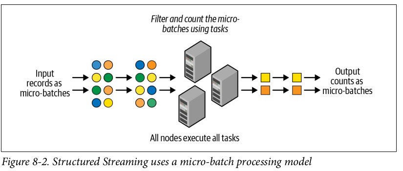

# Chapter 8
## Structured Streaming

In this chapter we will read about continuos streamed data.

### Evolution of the Apache Spark Stream Processing Engine 
The traditional stream processing method was *record-at-a-time* but due to slow recovery of the failure some new methods have been used. 

### Micro-Batch Stream Processing 
In *Micro-Batch-Stream Processing* the data is computed in a series on continuous of small map/reduce style batch processing jobs small chunks of the stream data. 

It divides a streaming data into small batches which helps to perform distributed manner and provides micro-batches outputs. This has following advantages. 
- It is fault tolerate and easy to recover by making multiple copies of the data
- It provides guarantee of end-to-end exactly one processing of the data due to ensuring the output data is same during re-execution 

It has overhead of latency as it can't provide millisecond-level latency but can provide the latency of few seconds. While it is not a fully stream like service but it has many advantage with its micro-batch processing. Most of the streaming pipeline have at-least one of the characteristics. 

- The pipelines doesn't need latency lower than a dew seconds. 
- There are already other larger delay exists in pipeline. For example, 

The DStream API was built upon Spark's batch RDD API. DStream had the same functional semantics and fault-tolerance model as RDDs. 