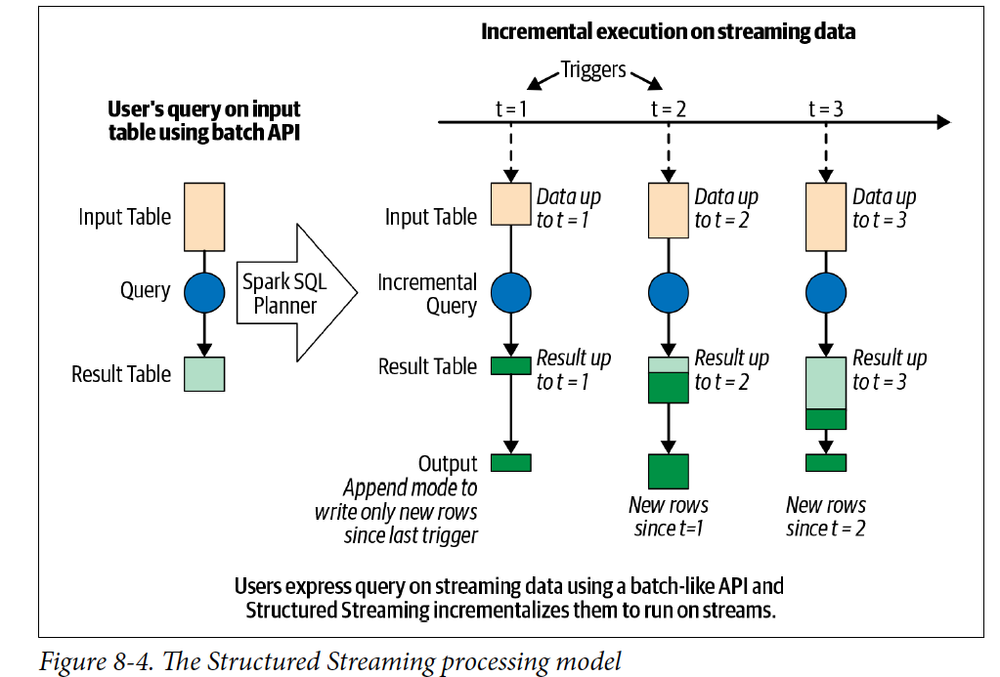

# Chapter 8
## Structured Streaming

In this chapter we will read about continuos streamed data.

### Evolution of the Apache Spark Stream Processing Engine 
The traditional stream processing method was *record-at-a-time* but due to slow recovery of the failure some new methods have been used. 

### Micro-Batch Stream Processing 
In *Micro-Batch-Stream Processing* the data is computed in a series on continuous of small map/reduce style batch processing jobs small chunks of the stream data. 


It divides a streaming data into small batches which helps to perform distributed manner and provides micro-batches outputs. This has following advantages. 
- It is fault tolerate and easy to recover by making multiple copies of the data
- It provides guarantee of end-to-end exactly one processing of the data due to ensuring the output data is same during re-execution 

It has overhead of latency as it can't provide millisecond-level latency but can provide the latency of few seconds. While it is not a fully stream like service but it has many advantage with its micro-batch processing. Most of the streaming pipeline have at-least one of the characteristics. 

- The pipelines doesn't need latency lower than a dew seconds. 
- There are already other larger delay exists in pipeline. For example, 

The DStream API was built upon Spark's batch RDD API. DStream had the same functional semantics and fault-tolerance model as RDDs. It makes it a unified processing engine to provide consistent API and semantics for batch, interactive and streaming workloads. This fundamental paradigm shift in stream processing makes Spark streaming a most widely used open source stream processing engines. 

## Lesson learned from the Spark Streaming (DStream)

There are following improvement have been made to the DStream 

- Made a unified single API for all the batch jobs 
- No need to hand optimization after creating separation between the logical and physical plans 
- It has native support for the event-time windows which makes easy to build the data pipelines for the developers 

## The Philosophy of Structured Streaming 

A new DStream, Structured Streaming was designed from scratch with one core philosophy - writing of stream processing should be as easy as writing the batch processing. The guiding principles of Structured Streaming are 

- A single unified programing model and interface for both batch and stream processing. It makes simple to query to SQL like batch processing in stream processing without getting worried about the underlying complexities. 
- A broader definition of stream processing. Any application that periodically to continuously processes data should be expressible using Structured Streaming 

## A Programming Model of Structured Streaming 

Structured Streaming extends the Table concept to streaming as unbounded table with continuous appended Table 

 
 The Structured Stream doesn't retain the data while it creates a static table with T duration of the data and it applied as a batch job on the table. 
 The developer define a query on this conceptual input table, as if it were a static table, to compute the result table that will be written to an output sink. Structured streaming will automatically convert this batch-like query to a stream execution plan. This is called *incrementalization*: Structured Streaming figures out what state needs to be maintained to update the result each time a record arrives. Finally, developers specify triggering policies to control when to update result. Each time a triggers fires, Structured Streaming check for new data and incrementally updates the result. 


For the output part of the model. Each time the result table is updated, the developer will want to write updates to an external systems, such as filesystem (HDFS, Amazon S3) or a database(MySQL, Cassandra). We usually want to write output incrementally. Structured Streaming provides three output modes: 

- **Append Mode** Only the new rows appended to the result table since the last trigger will be written to the external storage. This is application only in queries where the existing rows in the result cannot be change. 
- **Update Modes** Only the rows that were updated in the result table since the last trigger will be changed in the external storage. This mode works for the output sinks that can be updated in place, such as MySQL Table 
- **Complete Modes**The entire updated result table will be written to external storage

## The Fundamentals of a Structured Steaming Query 
We are going to cover some high-level concepts that we'll need to understand to develop Structured Streaming queries. We will define and start a streaming query, then we will discuss how to monitor the active query and manage its life cycle. 

### Five Steps to Define a Streaming Query

-**Step1 Define inputs sources** : As with batch queries, the first step is to define a DataFrame from a streaming source. For spark stream we can use `spark.readStream` to create `DataStreamReader.DataStreamReader` has most of the same methods as `DataFrameReader`

Example 
```
# In Python 
spark = SparkSession...
lines = (spark
    .readStream.format("socket")
    .option("host", "localhost")
    .option("port", 9999)
    .load())
```
The code generates the lines DataFrame as an unbounded table of newlines separated text data from local:9999, it only setup the configurations for the Stream but doesn't fetch the data until executed. Besides sockets Apache Spark natively supports reading data streams from Apache Kafka and all the various file-based formats that `DataFrameReader` supports (Parquet, ORC, JSON). The streaming query can define multiple input sources, both streaming and batch, which can be combined using DataFrame operations like unions and joins. 

- **Step 2 Transform Data** : Now we can apply the usual DataFrame operations, such as splitting the lines into individual words and them counting them 
```
# In python 
from pyspark.sql.functions import *
words = lines.select(split(col("value", "\\s").alias("word")))
counts = words.groupBy("word").count()
```
Here count is a *streaming* DataFrame that represents the running word counts that will be computed once the streaming query is started and the streaming input data is being continuously processed. These work exactly the same ways if the *lines* were a DataFrame. 
There are two classes of data transformation 

- Stateless Transformation
  - Operation like `select(), filter(), map()` do not require any information from previous rows to process the next row; each row can be processed by itself. The lack of previous state in these operation makes them stateless. Stateless operation can be applied to both batch and streaming DataFrames 
- Stateful Transformation 
  - An aggregation operation like `count()` requires maintaining state to combine data across multiple rows. Any DataFrame operation that requires grouping, joining or aggregating are stateful transformations. Many of them are supported by Streaming but some of them are computationally hard or infeasible to compute them in an incremental manner. 
- **Step 3: Define output sink and output mode** : After transforming the data, we can define how to write the processed output data with `DataFrame.writeStream`. This create a `DataStreamWriter` which, similar to DataFrameWriter, has additional methods to modify. 
  - Output writing details (where and gow to write the output)
  - Processing details (how to process data and how to recover from the failures)
```
# In Python 
writer = count.writeStream.format("console").outputMode("complete")
```
Here we have specified "console" as the output as the streaming sink and "complete" as the output mode. The output mode of the a streaming query specifics what part of the updated output to write out after processing new input data. 
- Append Mode
  - This the default mode, only the new rows added to the result table/DataFrame since the lst trigger will be output to that sink. Semantically, this mode guarantees that any row that is output is never going to changed or updated by the query in the future. Append mode support only those queries that will never modify previously output data. The word count query can update previously generated counts; therefore, it does not support append mode. 
- Complete Mode
  - In this model, all the roes of the result table/DataFrame will be output at the end of every trigger. This is supported by queries where the result table is likely to be much smaller than the input data and therefore can feasibly be retained in memory. Our word count query supports complete mode because the counts data is likely to be far smaller than the input data. 
- Update mode
  - In this model, only rws of the result table/DataFrame that were updated since the last trigger will be output at the end of the trigger. This is in contrast to append mode, as the output rows may be modified by the query and output again in the future. Most queries support update mode. It can write to Apache Kafka streams using `foreachBatch()` and `foreach()` API. 
- **Step 4: Specify processing details**
  - The final step before starting the query is to specify the details of how to process the data. 
  ```
  checkpointDir = "..."
  writer2 = (writer
    .trigger(processingTime = "1 second")
    .option("checkpointLocation", checkpointDir))
  ``` 
  Here we have specified two details using the `DataStreamWriter` that we created with `DataFrame.writeStream`

- Triggering details 
  - This indicates when to trigger the discovery and processing of newly available streaming data. There are four options: 
    - Default 
      - When the trigger is not explicitly specified, then by default, the streaming query executes data in micro-batches where the next micro-batch is triggered as soon as the previous micro-batch has completed 
    - Processing time with trigger interval
      - We can explicitly define the ProcessingTine trigger with an interval and the query will trigger micro-batches at that interval
    - Once 
      - In this mode, the streaming query will execute exactly one micro batch, it processes all the new data available in a single batch then stops itself. This is useful when we want to control the triggering and processing from an external schedular that will restart the query using any custom schedule. 
    - Continuous 
      - This is an experimental model, where the streaming query will process data continuously instead on micro-batches. Only a small DataFrame operation will be allowed in this mode but it can provide much lower latency thant the micro batch trigger modes. 
  - Checkpoint locations 
    - This is a directory in any HDFS compatible filesystem where the streaming query saves its progress information - that is, what data has been successfully processed. Upon failure, this metadata is used to restart the failed query exactly where it left off. Therefore, setting this option is necessary for failure recovery with exactly-once guarantees. 
- **Step 5 : Start the Query** : We can do following to start the query 
  - ``` streamingQuery = writer2.start()``` *start()* isa non-blocking method it will return as soon as the query has started in background we can use `streamingQuery.awaitTermination()` to block the main thread until the query terminates. We 
